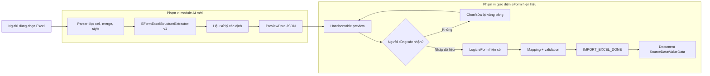
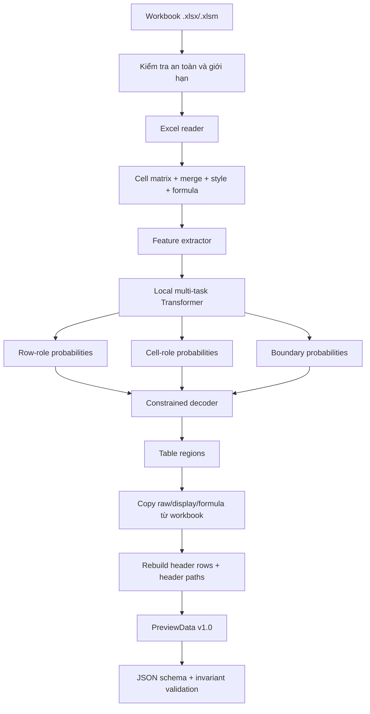
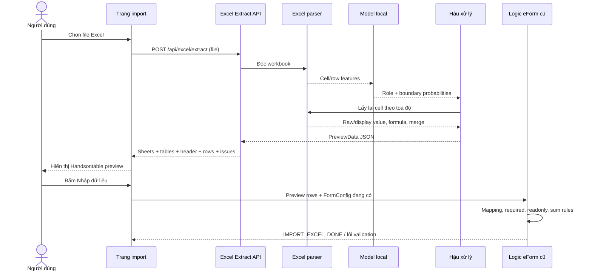
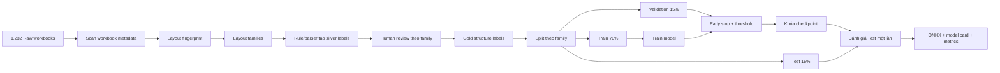
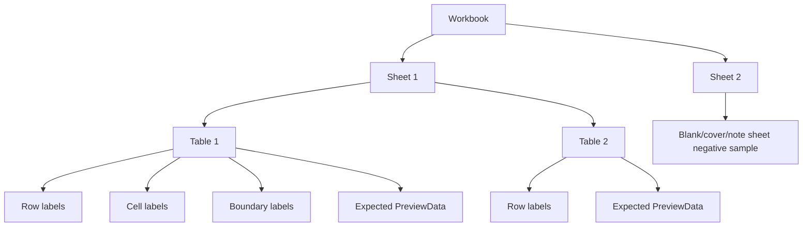
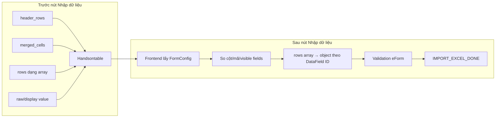
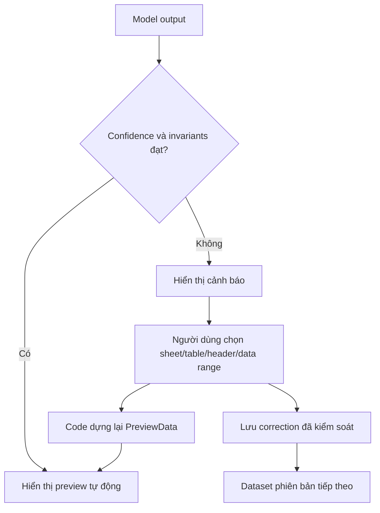

# SƠ ĐỒ KIẾN TRÚC VÀ DATA FLOW

## 1. Ranh giới hệ thống



Nguyên tắc ranh giới:

- AI dừng ở `PreviewData JSON`.
- AI không nhận `DocumentContent`.
- AI không chọn DataField.
- AI không ghi hoặc sửa document.
- Giá trị ô được copy từ workbook, không do model sinh.

## 2. Kiến trúc nội bộ module AI



## 3. Luồng dữ liệu suy luận



Không có lời gọi LLM hoặc API bên ngoài trong sequence này.

## 4. Data flow huấn luyện



## 5. Một workbook thành sample như thế nào?



Toàn bộ workbook và layout family phải nằm trong cùng một split.

## 6. Trạng thái row-role điển hình

```mermaid
stateDiagram-v2
    [*] --> TITLE
    TITLE --> TITLE
    TITLE --> METADATA
    METADATA --> METADATA
    METADATA --> HEADER
    TITLE --> HEADER
    HEADER --> HEADER
    HEADER --> COLUMN_CODE
    COLUMN_CODE --> DATA
    HEADER --> DATA
    DATA --> DATA
    DATA --> NOTE
    DATA --> FOOTER
    DATA --> TABLE_SEPARATOR
    TABLE_SEPARATOR --> HEADER
    NOTE --> FOOTER
    FOOTER --> FOOTER
    FOOTER --> [*]
```

Decoder không bắt buộc đúng duy nhất chuỗi trên, nhưng dùng nó để loại các chuyển trạng thái vô lý.

## 7. Cách tạo preview và cách nhập document



## 8. Fallback khi model không chắc chắn


