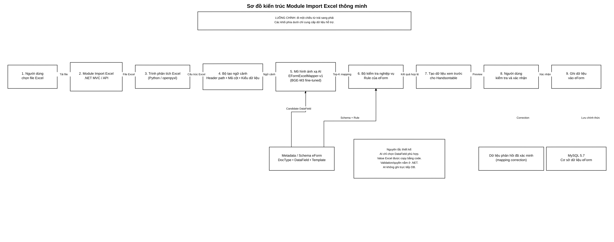
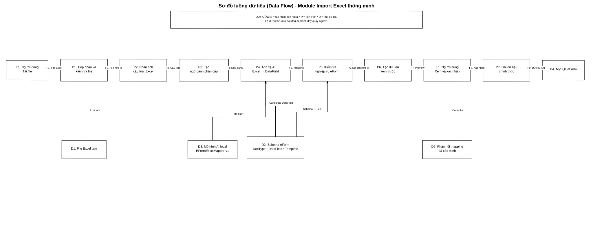

# BÁO CÁO TIẾN ĐỘ  
# NGHIÊN CỨU VÀ THIẾT KẾ MODULE IMPORT EXCEL THÔNG MINH CHO HỆ THỐNG eFORM

**Đề tài:** Nghiên cứu và ứng dụng AI xây dựng Module Import file Excel thông minh, tự động ánh xạ dữ liệu cho hệ thống Báo cáo thống kê eForm  
**Thời điểm báo cáo:** 03/09/2026  

## Mục tiêu tiến độ của giai đoạn

Giai đoạn này tập trung hoàn thành hai đầu việc chính:

1. **Chốt kiến trúc hệ thống và sơ đồ luồng dữ liệu (Data Flow) của Module Import Excel thông minh.**
2. **Chuẩn bị dữ liệu mẫu và thiết kế Prompt/Input có cấu trúc để mô hình AI hiểu được quan hệ phân cấp giữa các chỉ tiêu thống kê.**

---

# 1. Giới thiệu

Hệ thống eForm đang được sử dụng để quản lý các biểu báo cáo thống kê. Mỗi biểu có cấu trúc riêng gồm tiêu đề biểu, nhóm chỉ tiêu, tiêu đề nhiều tầng, mã cột, dòng dữ liệu, quy tắc tính toán và quy tắc kiểm tra nghiệp vụ.

Trong thực tế, dữ liệu do các đơn vị gửi về thường nằm trong file Excel. File Excel có thể khác với biểu eForm ở nhiều điểm:

- vị trí cột thay đổi;
- tên cột được viết tắt hoặc diễn đạt khác;
- có nhiều tầng tiêu đề;
- có merged cell;
- cùng một tên cột nhưng nằm dưới hai nhóm chỉ tiêu khác nhau;
- có nhiều sheet;
- có phần ghi chú, chữ ký hoặc dòng tổng hợp nằm ngoài vùng dữ liệu.

Nếu chỉ import theo tọa độ cố định, ví dụ:

```text
Cột C -> a1
Cột D -> a2
Cột E -> a3
```

thì hệ thống chỉ hoạt động tốt khi Excel luôn giữ đúng một mẫu cố định. Khi file thay đổi, người quản trị phải cấu hình lại.

Vì vậy, hướng nghiên cứu của đề tài là xây dựng Module Import Excel có khả năng:

```text
Đọc Excel
    ↓
Hiểu cấu trúc phân cấp của header
    ↓
Tìm DataField eForm tương ứng
    ↓
Kiểm tra nghiệp vụ
    ↓
Tạo dữ liệu xem trước
    ↓
Người dùng xác nhận
    ↓
Ghi dữ liệu vào eForm
```

AI chỉ được sử dụng ở phần cần hiểu ngữ nghĩa: **ánh xạ chỉ tiêu Excel sang DataField eForm**. Những phần có tính xác định như đọc ô Excel, copy giá trị, kiểm tra quyền, validation và ghi database vẫn do code thông thường xử lý.

---

# 2. Tìm hiểu kiến trúc hệ thống eForm hiện tại

## 2.1. Công nghệ đang sử dụng

Qua quá trình khảo sát hệ thống hiện tại, các công nghệ chính gồm:

| Thành phần | Công nghệ | Vai trò |
|---|---|---|
| Backend | ASP.NET MVC / .NET Framework | Xử lý request, nghiệp vụ và điều phối hệ thống |
| Data Access | Entity Framework 6, Repository | Truy xuất dữ liệu |
| Database | MySQL 5.7 | Lưu biểu mẫu, Document, DataField, cấu hình và dữ liệu báo cáo |
| Frontend | HTML, CSS, JavaScript, jQuery | Hiển thị giao diện |
| Bảng nhập liệu | Handsontable | Hiển thị và chỉnh sửa dữ liệu dạng bảng |
| AI/Excel Service mới | Python | Phân tích Excel và chạy mô hình AI local |

## 2.2. Giải thích đơn giản cách hệ thống eForm hoạt động

Có thể hiểu eForm hiện tại theo luồng:

```text
Người dùng
    ↓
Giao diện trên trình duyệt
    ↓
ASP.NET MVC Controller
    ↓
Business / Service
    ↓
Repository / Entity Framework
    ↓
MySQL
```

Khi người dùng mở một báo cáo, backend xác định `Document`, loại biểu (`DocType`) và các trường dữ liệu (`DataField`). Sau đó frontend dựng biểu nhập liệu bằng Handsontable.

Trong kiến trúc mới, **eForm vẫn là hệ thống chính**. Module AI không thay thế backend eForm mà được tích hợp như một thành phần hỗ trợ cho chức năng Import Excel.

## 2.3. Schema đích của việc ánh xạ

Excel là **nguồn dữ liệu**.

Các cấu hình của eForm là **schema đích**, chủ yếu gồm:

```text
DocType
DataField
DataFieldTemplate
Cấu hình header
Mã cột
Kiểu dữ liệu
Validation rule
```

Mục tiêu của mô hình AI là:

```text
Ngữ cảnh một cột Excel
        ↓
DataField phù hợp trong đúng biểu eForm
```

---

# 3. Phân tích, so sánh các mô hình AI để chọn giải pháp phù hợp

## 3.1. Bản chất bài toán

Đề tài không cần AI viết văn bản dài hoặc trò chuyện với người dùng.

Bài toán chính là:

> **Tìm trường dữ liệu eForm có ngữ nghĩa phù hợp nhất với một chỉ tiêu được đọc từ Excel.**

Đây là bài toán:

- Semantic Matching;
- Semantic Retrieval;
- Schema Mapping.

## 3.2. So sánh các phương án

| Phương án | Ưu điểm | Hạn chế | Đánh giá |
|---|---|---|---|
| Mapping theo tọa độ | Rất nhanh, dễ viết | Chỉ dùng được khi mẫu Excel cố định | Không phù hợp mục tiêu AI |
| Exact Matching | Chính xác khi tên giống hệt | Thay đổi cách viết là dễ thất bại | Dùng làm baseline |
| Fuzzy Matching | Chịu được một số sai khác chuỗi | Chưa hiểu tốt quan hệ cha - con của header | Dùng làm baseline |
| LSTM | Có thể tự huấn luyện | Cần nhiều dữ liệu, yếu hơn Transformer về biểu diễn ngữ nghĩa | Không chọn làm model chính |
| PhoBERT | Hiểu tiếng Việt tốt | Không được thiết kế chuyên cho retrieval | Có thể benchmark |
| multilingual-e5 | Phù hợp semantic retrieval | Cần kiểm thử trên domain eForm | Ứng viên tốt |
| LLM 3B/7B | Hiểu ngữ cảnh mạnh | Nặng, chậm, output khó kiểm soát, không cần thiết cho mapping thuần | Không tối ưu |
| **BGE-M3** | Phù hợp retrieval, hỗ trợ đa ngôn ngữ và fine-tuning bằng positive/hard negative | Phụ thuộc chất lượng dataset | **Chọn làm hướng chính** |

## 3.3. Mô hình được chọn

Base model dự kiến:

```text
BAAI/bge-m3
      ↓
Fine-tune bằng dữ liệu eForm
      ↓
EFormExcelMapper-v1
```

Tên kỹ thuật của mô hình sau huấn luyện:

> **Domain-adapted Semantic Embedding Model for Excel-to-eForm Schema Mapping**

Có thể gọi ngắn gọn trong dự án:

> **EFormExcelMapper-v1**

## 3.4. Vì sao chọn BGE-M3

BGE-M3 phù hợp vì luồng suy luận của model gần với bài toán:

```text
Excel Context
     ↓ embedding

eForm DataField
     ↓ embedding

So sánh độ tương đồng
     ↓

Top-1 / Top-K DataField phù hợp
```

Mô hình không cần tự tạo giá trị báo cáo. AI chỉ chọn **vị trí đích**. Giá trị thực tế vẫn lấy nguyên từ Excel bằng code.

---

# 4. Thiết kế kiến trúc Module Import Excel thông minh

## 4.1. Sơ đồ kiến trúc



**File Draw.io:** `So_do_kien_truc_Module_Import_Excel.drawio`

Sơ đồ được bố trí cố ý theo **một luồng duy nhất từ trái sang phải**. Không sử dụng dây quay ngược qua toàn sơ đồ.

## 4.2. Luồng xử lý chính

```text
1. Người dùng chọn file Excel
        ↓
2. Module Import Excel .NET nhận file
        ↓
3. Python phân tích workbook
        ↓
4. Tạo ngữ cảnh phân cấp
        ↓
5. AI ánh xạ sang DataField
        ↓
6. .NET kiểm tra nghiệp vụ
        ↓
7. Tạo dữ liệu xem trước
        ↓
8. Người dùng kiểm tra và xác nhận
        ↓
9. Ghi dữ liệu chính thức vào eForm
```

## 4.3. Giải thích các thành phần

### 4.3.1. Người dùng

Người dùng chọn file Excel và thực hiện Import.

Ở cuối luồng, người dùng xem kết quả ánh xạ và dữ liệu preview trước khi xác nhận.

### 4.3.2. Module Import Excel trên .NET

Đây là thành phần điều phối chính.

Nhiệm vụ:

- nhận file upload;
- kiểm tra quyền;
- xác định Document và DocType;
- lấy schema DataField;
- gọi dịch vụ xử lý Excel/AI;
- nhận Mapping Plan;
- chạy validation;
- trả preview;
- ghi dữ liệu khi được xác nhận.

### 4.3.3. Trình phân tích Excel

Sử dụng Python và `openpyxl`.

Nhiệm vụ:

- đọc workbook;
- duyệt sheet;
- đọc merged cell;
- phát hiện dòng mã cột;
- dựng header nhiều tầng;
- xác định kiểu dữ liệu;
- lấy một số sample value.

Đây là code deterministic, không phải AI.

### 4.3.4. Bộ tạo ngữ cảnh

Ví dụ từ Excel:

```text
Số VBQPPL đã được ban hành tại cấp xã
    └── Chia theo tên loại VBQPPL
        └── Quyết định của UBND
            └── (3)
```

được chuyển thành:

```text
[DOCTYPE] 01c/TP/BH-TĐG
[PARENT] Số VBQPPL đã được ban hành tại cấp xã
         > Chia theo tên loại VBQPPL
[HEADER] Quyết định của UBND
[CODE] (3)
[TYPE] number
```

### 4.3.5. Mô hình ánh xạ AI

`EFormExcelMapper-v1` nhận:

```text
Ngữ cảnh Excel
+
Danh sách DataField ứng viên của đúng DocType
```

và trả về:

```text
DataField Top-1
Top-K candidates
Similarity / confidence
```

### 4.3.6. Bộ kiểm tra nghiệp vụ

Validation vẫn nằm ở eForm/.NET.

Ví dụ:

```text
(1) = (2) + (3)
```

hoặc:

```text
Nếu (8) > (2)
→ bắt buộc nhập thuyết minh
```

AI không tự quyết định các rule này.

### 4.3.7. Preview

Sau khi có mapping:

```text
Excel Column
      ↓
DataField
```

code tạo ma trận dữ liệu 2 chiều và đưa vào Handsontable để người dùng xem trước.

### 4.3.8. Ghi dữ liệu

AI **không truy cập trực tiếp database**.

Chỉ backend .NET thực hiện lưu sau khi người dùng xác nhận.

---

# 5. Sơ đồ luồng dữ liệu - Data Flow

## 5.1. Sơ đồ



**File Draw.io:** `So_do_luong_du_lieu_Data_Flow.drawio`

## 5.2. Quy ước

```text
E = External Entity / Tác nhân bên ngoài
P = Process / Tiến trình
D = Data Store / Kho dữ liệu
```

`E1. Người dùng` được vẽ ở **cả đầu và cuối luồng**. Đây vẫn là cùng một người dùng, nhưng được lặp lại để sơ đồ không cần một đường dây quay ngược từ phải sang trái.

## 5.3. Các tiến trình

| Mã | Tiến trình | Mô tả |
|---|---|---|
| P1 | Tiếp nhận và kiểm tra file | Kiểm tra file Excel đầu vào |
| P2 | Phân tích cấu trúc Excel | Đọc sheet, merged cell, header và mã cột |
| P3 | Tạo ngữ cảnh phân cấp | Chuyển cấu trúc Excel thành input semantic |
| P4 | Ánh xạ AI | Tìm DataField phù hợp |
| P5 | Kiểm tra nghiệp vụ | Kiểm tra rule và cấu trúc eForm |
| P6 | Tạo dữ liệu xem trước | Tạo Mapping Plan và ma trận Handsontable |
| P7 | Ghi dữ liệu chính thức | Lưu dữ liệu sau xác nhận |

## 5.4. Các kho dữ liệu

| Mã | Kho dữ liệu | Nội dung |
|---|---|---|
| D1 | File Excel tạm | File vừa được upload |
| D2 | Schema eForm | DocType, DataField, Template, Rule |
| D3 | Mô hình AI local | EFormExcelMapper-v1 |
| D4 | MySQL eForm | Dữ liệu chính thức |
| D5 | Phản hồi mapping | Correction đã được người dùng/xác minh viên kiểm tra |

## 5.5. Luồng dữ liệu chính

```text
F1. File Excel
E1 → P1

F2. File hợp lệ
P1 → P2

F3. Cấu trúc Excel
P2 → P3

F4. Ngữ cảnh phân cấp
P3 → P4

F5. Mapping
P4 → P5

F6. Dữ liệu hợp lệ
P5 → P6

F7. Preview
P6 → E1

F8. Xác nhận
E1 → P7

F9. Dữ liệu lưu
P7 → D4
```

---

# 6. Lập trình Backend (.NET MVC): Xây dựng API đọc và bóc tách dữ liệu từ file Excel thô thành cấu trúc JSON phẳng

Backend Web API 2 trên .NET Framework 4.8 đã được dựng theo Clean Architecture. API `POST /api/import/parse` nhận multipart Excel, kiểm tra request/quyền, gọi AI service và trả JSON phẳng gồm `columns`, `rows`, `row_count`, `valid`, `issues`.

# 7. Quản lý code bằng Git, thực hiện Commit/Pull Request chuẩn chỉnh

Mã nguồn được tổ chức trong solution và thay đổi theo commit có phạm vi rõ ràng. Khi làm việc nhóm cần dùng branch theo tính năng, commit nhỏ mô tả đúng thay đổi, mở Pull Request kèm mô tả, kết quả build và kiểm tra trước khi merge.

# 8. Chuẩn bị dữ liệu mẫu

## 6.1. Cấu trúc thư mục dataset

Cấu trúc đã được tối giản:

```text
Data/
│
├── Raw/
│   └── *.xlsx
│
├── Labels/
│   ├── mappings.jsonl
│   └── eform_fields.jsonl
│
├── Train/
│   └── train.jsonl
│
├── Validation/
│   └── validation.jsonl
│
├── Test/
│   ├── test.jsonl
│   └── ground_truth.jsonl
│
└── Manifest.jsonl
```

## 6.2. Raw data

`Raw/` chứa nguyên các file Excel thực tế.

Ví dụ:

```text
Raw/
├── So_Tu_phap_Ha_Noi_01c.xlsx
├── UBND_Phuong_Lang_01a.xlsx
├── Tong_hop_bieu_mau_KHTC.xlsx
└── ...
```

Raw file không cần tự chứa label.

## 6.3. Một raw workbook tạo ra nhiều sample

Ví dụ biểu `01c/TP/BH-TĐG` có các mã:

```text
(1) (2) (3) (4) (5) (6) (7) (8) (9)
```

thì một workbook có thể tạo ít nhất 9 sample mapping.

Một sample là:

> **một quyết định ánh xạ một chỉ tiêu/cột Excel sang một DataField**

Không phải:

> một workbook = một sample.

## 6.4. Ground truth

Ví dụ:

```json
{
  "file": "So_Tu_phap_Ha_Noi_01c.xlsx",
  "sheet": "1c",
  "doc_type_code": "01c/TP/BH-TĐG",
  "header_path": [
    "Số VBQPPL đã được ban hành tại cấp xã",
    "Chia theo tên loại VBQPPL",
    "Quyết định của UBND"
  ],
  "column_code": "(3)",
  "target_data_field_id": "REAL_DATAFIELD_ID",
  "verified": true
}
```

Chỉ record `verified=true` mới được sử dụng làm ground truth để train.

---

# 7. Thiết kế Prompt/Input để AI hiểu cấu trúc phân cấp

## 7.1. Vì sao không dùng mỗi tên header

Trong một biểu có thể tồn tại:

```text
Tổng số
Tổng số
Tổng số
```

hoặc:

```text
Quyết định của UBND
```

ở nhiều nhánh khác nhau.

Nếu model chỉ nhận:

```text
[HEADER] Quyết định của UBND
```

thì không đủ thông tin.

Do đó input phải giữ được **đường dẫn phân cấp**.

## 7.2. Mẫu Prompt/Input phía Excel

```text
[TASK] Excel to eForm DataField Mapping

[DOCTYPE]
{doc_type_code}

[REPORT]
{report_title}

[PARENT]
{parent_header_1}
>
{parent_header_2}
>
{parent_header_n}

[HEADER]
{current_header}

[CODE]
{column_code}

[TYPE]
{data_type}
```

## 7.3. Mẫu target phía eForm

```text
[DOCTYPE]
{doc_type_code}

[FIELD_NAME]
{field_name}

[FIELD]
{field_title}

[CODE]
{column_code}
```

`DataFieldId` được giữ dưới dạng metadata để biết đáp án đúng, nhưng không nên đưa trực tiếp vào text embedding vì ID không mang ý nghĩa ngôn ngữ.

## 7.4. Ví dụ thực tế

### Query

```text
[TASK] Excel to eForm DataField Mapping
[DOCTYPE] 01c/TP/BH-TĐG
[REPORT] Số VBQPPL được ban hành; số VBQPPL ban hành có đánh giá tác động giới
[PARENT] Số VBQPPL đã được ban hành tại cấp xã
         > Chia theo tên loại VBQPPL
[HEADER] Quyết định của UBND
[CODE] (3)
[TYPE] number
```

### Positive

```text
[DOCTYPE] 01c/TP/BH-TĐG
[FIELD_NAME] a3
[FIELD] Số VBQPPL đã được ban hành tại cấp xã - Quyết định của UBND
[CODE] (3)
```

### Hard Negative

```text
[DOCTYPE] 01c/TP/BH-TĐG
[FIELD_NAME] a7
[FIELD] Số VBQPPL được đánh giá tác động giới tại cấp tỉnh - Quyết định của UBND
[CODE] (7)
```

Hard Negative có câu chữ rất gần Positive nhưng nằm ở nhánh nghiệp vụ khác.

Đây là dữ liệu có giá trị để model học được cấu trúc phân cấp.

---

# 8. Tool xây dựng dataset

Notebook `DatasetBuilder` được thiết kế theo luồng:

```text
Raw/*.xlsx
    ↓
Đọc workbook
    ↓
Đọc sheet
    ↓
Phân tích merged header
    ↓
Tìm dòng mã (1), (2), (3), ...
    ↓
Dựng header_path
    ↓
Sinh Labels/mappings.jsonl
    ↓
Xác minh DataField đúng
    ↓
verified = true
    ↓
Sinh Positive + Hard Negative
    ↓
Chia Train / Validation / Test
```

## 8.1. Chống data leakage

Không chia:

```text
Cột 1,2,3 của Workbook A -> Train
Cột 4,5 của Workbook A   -> Test
```

Mà chia theo workbook:

```text
Workbook A -> Train
Workbook B -> Train
Workbook C -> Validation
Workbook D -> Test
```

Như vậy test mới phản ánh tốt hơn khả năng xử lý Excel chưa từng thấy.

---

# 9. Quy trình huấn luyện dự kiến

```text
BGE-M3 pretrained
       +
Train Dataset eForm
       ↓
Contrastive Fine-tuning
       ↓
Validation
       ↓
Chọn checkpoint tốt nhất
       ↓
EFormExcelMapper-v1
```

Mục tiêu:

```text
similarity(Query, Positive)
→ tăng

similarity(Query, Hard Negative)
→ giảm
```

---

# 10. Chỉ số đánh giá dự kiến

Các chỉ số chính:

| Chỉ số | Ý nghĩa |
|---|---|
| Top-1 Accuracy | DataField đứng đầu có đúng không |
| Top-3 Accuracy | Đáp án đúng có nằm trong 3 candidate đầu không |
| MRR | Đánh giá thứ hạng đáp án đúng |
| Precision | Các mapping model chấp nhận có bao nhiêu mapping đúng |
| Recall | Model tìm được bao nhiêu mapping đúng |
| F1 | Cân bằng Precision và Recall |
| Auto-mapping Coverage | Bao nhiêu % trường được tự động mapping ở ngưỡng confidence yêu cầu |

Ví dụ mục tiêu đánh giá có thể biểu diễn:

```text
Confidence >= 0.90
Coverage = 80%
Accuracy trên nhóm auto-map = 97%
```

---

# 11. Kết quả tiến độ hiện tại

| Nội dung | Trạng thái | Kết quả |
|---|---|---|
| Tìm hiểu kiến trúc eForm hiện tại | Hoàn thành | Xác định các thành phần và vị trí tích hợp |
| Phân tích bài toán Import Excel | Hoàn thành | Chốt bài toán semantic schema mapping |
| So sánh các hướng AI | Hoàn thành bước lựa chọn | Chọn BGE-M3 làm hướng model chính |
| **Thiết kế kiến trúc Module Import Excel** | **Hoàn thành** | Đã chốt luồng một chiều dễ triển khai |
| **Thiết kế Data Flow** | **Hoàn thành** | Đã chốt E/P/D và luồng dữ liệu |
| **Chuẩn bị cấu trúc dataset** | **Hoàn thành** | Raw / Labels / Train / Validation / Test |
| **Thiết kế Prompt/Input phân cấp** | **Hoàn thành bước thiết kế** | DocType + Report + Parent + Header + Code + Type |
| Xây Dataset Builder | Đã có bản đầu | Tự đọc Excel và tạo mapping sample |
| Thu thập verified mapping quy mô lớn | Đang thực hiện | Cần thêm nhiều biểu thực tế |
| Fine-tune BGE-M3 trên Colab | Chưa thực hiện | Bước tiếp theo |
| Đánh giá model | Chưa thực hiện | Thực hiện sau fine-tune |
| Tích hợp API hoàn chỉnh vào eForm | Chưa thực hiện | Thực hiện sau khi model đạt yêu cầu |

---

# 12. Dataset dùng để làm gì và khả năng xử lý dữ liệu mới

Dataset dùng để dạy model quan hệ giữa ngữ cảnh header Excel, DocTypeCode và DataField eForm; không dùng để học thuộc giá trị báo cáo cụ thể.

Model có thể mapping file mới nếu thuộc DocType đã có schema và header tương tự dữ liệu train. Với cấu trúc hoặc nghiệp vụ hoàn toàn mới, model chỉ trả candidate Top-K và confidence để người dùng xác nhận.

Ngưỡng vận hành: confidence >= 0.90 có thể auto-map sau validation; 0.70–0.90 cần duyệt; dưới 0.70 không tự động map. Khả năng tổng quát chỉ được khẳng định sau đánh giá trên workbook chưa từng có trong train bằng Top-1, Top-3, MRR và coverage.

## 12.1. Đánh giá tiến độ thực tế

| Hạng mục | Trạng thái | Đánh giá |
|---|---|---|
| Parser Excel và JSON phẳng | Hoàn thành | Đã có API và pipeline |
| Tách DocTypeCode | Hoàn thành | 1.231/1.232 file, 27 mã biểu |
| Sinh eform_fields.jsonl | Hoàn thành bước schema | 434 field từ 30 mẫu |
| Mapping candidate | Hoàn thành | 14.649 candidate |
| Verified ground truth | Chưa đạt | Verified hiện bằng 0 |
| Dataset train có nhãn | Chưa đạt | Chưa nên fine-tune khi chưa có nhãn |
| Notebook Colab 100 epochs | Đã chuẩn bị | Chờ verified dataset |
| Backend API | Đạt bản chạy nền | Cần thay quyền local bằng quyền eForm thật |
| Git commit/Pull Request | Đã quy định quy trình | Cần áp dụng khi merge nhóm |

# 13. Kết luận

Giai đoạn hiện tại đã chốt được hai nội dung quan trọng:

## 12.1. Kiến trúc và Data Flow

Module Import Excel được thiết kế theo nguyên tắc:

```text
Excel
  ↓
Parser
  ↓
Ngữ cảnh phân cấp
  ↓
AI ánh xạ
  ↓
.NET Validation
  ↓
Preview
  ↓
Người dùng xác nhận
  ↓
Database
```

Luồng chính rõ ràng, AI không được quyền ghi trực tiếp database và không chịu trách nhiệm cho các quy tắc nghiệp vụ có tính xác định.

## 12.2. Dữ liệu và Prompt/Input

Dataset được xây theo bài toán:

```text
Excel Context
      ↕
Correct eForm DataField
      ≠
Hard Negative DataField
```

Input giữ lại đầy đủ cấu trúc phân cấp của header, giúp model phân biệt các chỉ tiêu có tên giống nhau nhưng thuộc các nhánh nghiệp vụ khác nhau.

## 12.3. Công việc tiếp theo

```text
Thu thập thêm Excel thực tế
        ↓
Hoàn thiện verified labels
        ↓
Fine-tune BGE-M3 trên Colab
        ↓
Đánh giá Top-1 / Top-3 / MRR / Coverage
        ↓
Xây AI Service local
        ↓
Tích hợp Module Import vào eForm
```

---

# Phụ lục - File kèm theo

- `So_do_kien_truc_Module_Import_Excel.drawio` — sơ đồ kiến trúc nguồn Draw.io.
- `So_do_luong_du_lieu_Data_Flow.drawio` — sơ đồ Data Flow nguồn Draw.io.
- `So_do_kien_truc_Module_Import_Excel.svg` — bản xem nhanh sơ đồ kiến trúc.
- `So_do_luong_du_lieu_Data_Flow.svg` — bản xem nhanh Data Flow.
- `So_do_kien_truc_Module_Import_Excel.png` — ảnh xem nhanh nếu môi trường hỗ trợ render.
- `So_do_luong_du_lieu_Data_Flow.png` — ảnh xem nhanh nếu môi trường hỗ trợ render.

Các file Draw.io sử dụng các đường nối có tọa độ cố định thay vì để Draw.io tự động định tuyến, nhằm tránh tình trạng dây nối bị mất hoặc tự chạy xuyên qua các ô.
## Cập nhật thực tế 04/09/2026

- DatasetBuilder.ipynb tự lấy DocTypeCode từ tên file raw.
- Đã quét 1.232 workbook, nhận diện 1.231 file theo 27 mã biểu.
- AI trả columns, rows, row_count, valid, issues; backend trả nguyên JSON cho FE qua POST /api/import/parse.
- Train/validation/test cần nhãn DataField xác nhận; mapping candidates đã sinh tự động.

## Cập nhật 10/09/2026 - ánh xạ phân cấp và JSON chuẩn

- Đã tách ánh xạ cột và ánh xạ hàng phân cấp `Tổng số → Mục La Mã → số nguyên → số thập phân`.
- Prompt LLM dùng `source_ref/target_ref`, `kind`, `level`, `parent_ref`, `path` và JSON Schema strict; không truyền số liệu báo cáo.
- Hậu kiểm deterministic chặn ID tự sinh, target trùng, nhầm cấp và nhầm nhánh cha/con; lỗi LLM fallback về baseline.
- Parser tách nhiều bảng trong cùng sheet theo từng dòng mã cột, không còn đưa giá trị của bảng trước vào `header_path`.
- Candidate/template chỉ là gợi ý; nhãn train bắt buộc có `verified=true` và `verification_method=human|curated|reviewed`.
- Đã sửa bộ sinh `eform_fields.jsonl` để nhóm theo marker DocType và giữ `form_index`; tránh lệch mã biểu khi một DocType có nhiều `DocumentContents`. Snapshot hiện sinh 434 field/30 form.
- `TrainAiImport.ipynb` chỉ nạp split `query/pos/neg` đã build và dùng hard-negative; không còn ghi đè split bằng record mapping thô.
