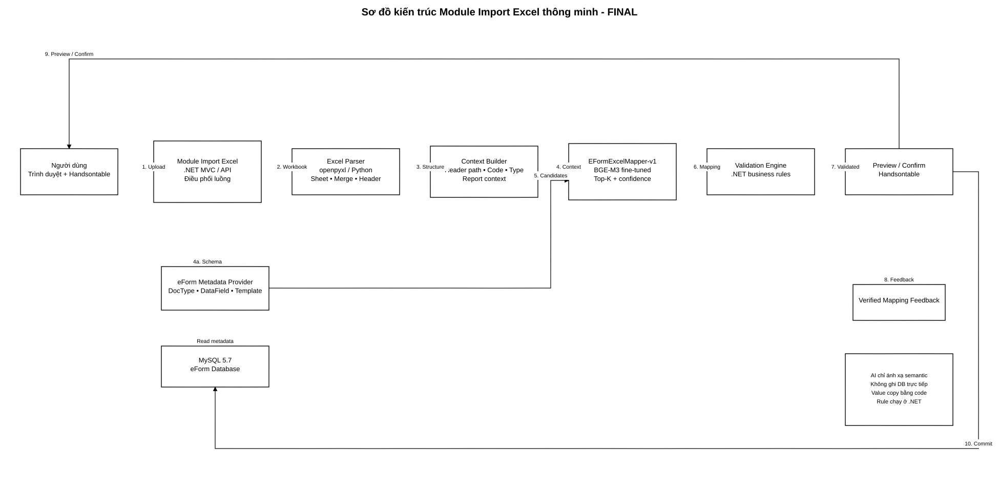
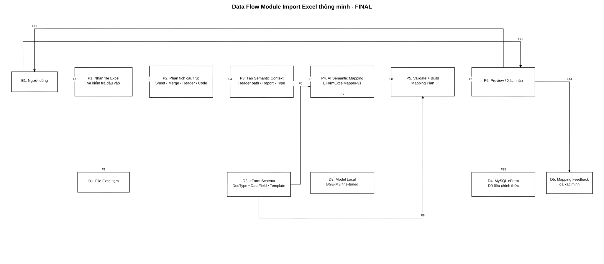

# BÁO CÁO TIẾN ĐỘ NGHIÊN CỨU VÀ THIẾT KẾ MODULE IMPORT EXCEL THÔNG MINH

**Đề tài:** Nghiên cứu và ứng dụng AI xây dựng Module Import file Excel thông minh, tự động ánh xạ dữ liệu cho hệ thống Báo cáo thống kê eForm  
**Thời điểm báo cáo:** 03/09/2026

**Phiên bản sơ đồ:** FINAL - đã bố trí lại luồng để các dây dẫn không đè lên nhau, không xuyên qua khối và không bị khối che khuất.  
**Trọng tâm tiến độ:**  
- Chốt kiến trúc hệ thống và luồng dữ liệu (Data Flow) cho Module Import Excel thông minh.  
- Chuẩn bị dữ liệu mẫu và thiết kế cấu trúc Prompt/Input để mô hình AI hiểu cấu trúc phân cấp của các chỉ tiêu thống kê.

---

## 1. Giới thiệu

Hệ thống eForm hiện tại phục vụ việc quản lý, nhập liệu, tổng hợp và hiển thị các biểu báo cáo thống kê. Mỗi biểu báo cáo có cấu trúc riêng, bao gồm nhiều tầng tiêu đề, các cột chỉ tiêu, mã cột, dòng dữ liệu và các quy tắc kiểm tra nghiệp vụ.

Trong thực tế, dữ liệu do đơn vị gửi lên thường tồn tại dưới dạng file Excel. Các file này không phải lúc nào cũng có vị trí cột, cách đặt tên tiêu đề hoặc số tầng header hoàn toàn giống với biểu trong eForm. Một số file có merged cell, một số có nhiều sheet, một số thay đổi câu chữ nhưng vẫn mang cùng ý nghĩa nghiệp vụ.

Nếu chỉ ánh xạ theo vị trí ô hoặc cấu hình cố định như:

```text
Cột C -> DataField a1
Cột D -> DataField a2
Cột E -> DataField a3
```

thì mỗi khi biểu Excel thay đổi vị trí hoặc cách diễn đạt, người quản trị phải cấu hình lại.

Mục tiêu của Module Import Excel thông minh là xây dựng một lớp xử lý có khả năng:

1. Đọc file Excel thực tế.
2. Phân tích cấu trúc sheet, merged cell và header nhiều tầng.
3. Tạo ngữ cảnh semantic cho từng chỉ tiêu.
4. Sử dụng mô hình AI để tìm DataField eForm phù hợp nhất.
5. Kiểm tra kết quả bằng rule nghiệp vụ của eForm.
6. Trả về Mapping Plan và dữ liệu preview cho Handsontable.
7. Chỉ ghi dữ liệu chính thức sau khi người dùng xác nhận.

Phạm vi nghiên cứu hiện tại tập trung vào **AI semantic mapping, dữ liệu huấn luyện, kiến trúc tích hợp và Data Flow**. Phần giao diện hoàn chỉnh sẽ được triển khai sau khi mô hình và API ổn định.

---

## 2. Tìm hiểu kiến trúc hệ thống eForm hiện tại

### 2.1. Công nghệ đang sử dụng

Qua quá trình khảo sát source code hiện tại, hệ thống eForm đang sử dụng các thành phần chính sau:

| Thành phần | Công nghệ | Vai trò |
|---|---|---|
| Backend | ASP.NET MVC / .NET Framework | Xử lý request, nghiệp vụ và giao tiếp dữ liệu |
| Data Access | Entity Framework 6, Repository | Truy vấn và cập nhật dữ liệu |
| Database | MySQL 5.7 | Lưu Document, biểu mẫu, DataField, dữ liệu báo cáo và cấu hình |
| Frontend | HTML, CSS, JavaScript, jQuery | Giao diện người dùng |
| Bảng nhập liệu | Handsontable | Hiển thị và chỉnh sửa dữ liệu dạng bảng |
| Excel/AI Service mới | Python | Đọc Excel, xử lý dữ liệu và chạy model AI local |

### 2.2. Giải thích đơn giản về luồng hoạt động hiện tại

Có thể hiểu hệ thống eForm hiện tại theo luồng đơn giản:

```text
Người dùng
    ↓
Trang eForm trên trình duyệt
    ↓
ASP.NET MVC Controller
    ↓
Business / Service Layer
    ↓
Repository / Entity Framework
    ↓
MySQL
```

Khi mở một biểu báo cáo, backend lấy thông tin Document, loại biểu và cấu hình DataField từ database. Frontend sau đó dựng bảng Handsontable dựa trên cấu trúc biểu đã được định nghĩa trong eForm.

Các thành phần như **DocType, DataField, DataFieldTemplate và cấu hình biểu** đóng vai trò là schema đích. Module AI Import không được tự tạo schema mới mà phải ánh xạ dữ liệu Excel về đúng schema này.

### 2.3. Vấn đề của import Excel theo cấu hình cố định

Các phương pháp truyền thống có thể dùng:

- ánh xạ theo vị trí cột;
- ánh xạ theo mã `(1)`, `(2)`, `(3)`;
- so khớp chính xác tên header;
- dictionary alias;
- fuzzy matching.

Các phương pháp trên vẫn hữu ích nhưng có hạn chế khi:

- cột bị đổi vị trí;
- tên cột viết tắt;
- tiêu đề có nhiều tầng;
- nhiều cột cùng có tên `"Tổng số"`;
- cùng một tên `"Quyết định của UBND"` nhưng thuộc hai nhánh nghiệp vụ khác nhau;
- file có nhiều sheet hoặc merged cells khác nhau.

Do đó, AI được sử dụng ở đúng phần khó nhất: **hiểu ngữ nghĩa của toàn bộ đường dẫn header và chọn DataField tương ứng**.

---

## 3. Phân tích và so sánh các mô hình AI/LLM

Bài toán cần giải quyết không phải là sinh văn bản tự do mà là:

```text
Excel semantic context
        ↓
Tìm DataField eForm phù hợp nhất
```

Vì vậy bản chất bài toán là **semantic matching / semantic retrieval / schema mapping**.

### 3.1. So sánh các phương án

| Mô hình / phương pháp | Ưu điểm | Hạn chế | Mức phù hợp |
|---|---|---|---|
| Exact / Rule Mapping | Nhanh, dễ kiểm soát | Phải cấu hình nhiều, không chịu được thay đổi câu chữ | Thấp nếu Excel đa dạng |
| Fuzzy Matching | Dễ triển khai, tốt hơn exact match | Chủ yếu so độ giống chuỗi, chưa hiểu cấu trúc phân cấp | Trung bình |
| LSTM | Có thể huấn luyện theo dữ liệu riêng | Cần nhiều dữ liệu để học ngôn ngữ, yếu hơn Transformer cho semantic retrieval | Thấp - dùng làm baseline |
| PhoBERT | Hiểu tiếng Việt tốt | Không được thiết kế trực tiếp cho retrieval, cần tự xây pooling/training objective | Khá |
| multilingual-e5 | Phù hợp semantic retrieval, đa ngôn ngữ | Cần benchmark thực tế với dữ liệu eForm | Tốt |
| Qwen Embedding | Mô hình embedding hiện đại, semantic tốt | Tài nguyên chạy có thể cao hơn | Tốt |
| LLM 3B/7B sinh text | Khả năng hiểu ngữ cảnh mạnh | Nặng, inference chậm, output khó kiểm soát, không cần thiết cho mapping thuần | Không tối ưu |
| **BGE-M3** | Thiết kế phù hợp retrieval, đa ngôn ngữ, hỗ trợ fine-tuning bằng positive/hard negative | Vẫn cần dataset domain eForm được gán nhãn tốt | **Phù hợp nhất để thử nghiệm chính** |

### 3.2. Giải pháp được lựa chọn

Mô hình nền được lựa chọn cho hướng triển khai chính là:

```text
BAAI/bge-m3
      ↓
Domain Fine-tuning
      ↓
EFormExcelMapper-v1
```

Tên kỹ thuật của hướng này có thể mô tả là:

> **Domain-adapted Semantic Embedding Model for Excel-to-eForm Schema Mapping.**

Lý do lựa chọn:

- bài toán cần ranking DataField thay vì sinh câu trả lời dài;
- model có thể biểu diễn source Excel và target DataField thành vector semantic;
- phù hợp với positive pair và hard negative;
- có thể chạy local;
- dễ mở rộng khi eForm thêm DataField mới;
- giảm nguy cơ hallucination so với việc yêu cầu LLM sinh trực tiếp ID/giá trị.

Một nguyên tắc thiết kế quan trọng là:

> **AI quyết định “dữ liệu này thuộc trường nào”, còn code thông thường chịu trách nhiệm copy giá trị, validate và ghi database.**

---

# 4. Thiết kế kiến trúc Module Import Excel thông minh

## 4.1. Kiến trúc tổng thể



**File nguồn Draw.io:** `So_do_kien_truc_AI_Import_Excel_FINAL.drawio`

Sơ đồ được thiết kế dạng sketch/vẽ tay, chỉ sử dụng hộp, chữ và mũi tên, màu đen trắng, không sử dụng icon. Bố cục FINAL sử dụng các hành lang dây riêng cho luồng chính, luồng schema, feedback, preview/confirm và commit để tránh dây giao nhau hoặc xuyên qua các khối.

### 4.1.1. Quy ước đọc sơ đồ kiến trúc FINAL

Sơ đồ được bố trí theo ba vùng:

```text
Hàng chính:
Người dùng → .NET Import API → Excel Parser → Context Builder
→ AI Mapper → Validation → Preview

Hàng dữ liệu:
eForm Metadata Provider → MySQL

Luồng ngoài:
Preview/Confirm đi theo hành lang phía trên;
Commit đi theo hành lang phía dưới;
Feedback đi theo nhánh riêng.
```

Cách bố trí này giúp sơ đồ phản ánh rõ trách nhiệm của từng thành phần mà không làm rối luồng xử lý.

## 4.2. Các thành phần chính

### A. Người dùng và Handsontable

Người dùng chọn file Excel và gửi lên hệ thống. Sau khi xử lý, kết quả mapping được trả về dưới dạng preview để người dùng kiểm tra trước khi ghi dữ liệu.

### B. Module Import Excel trên .NET

Đây là lớp điều phối chính và vẫn thuộc hệ thống eForm.

Nhiệm vụ:

- nhận file;
- xác định Document / DocType hiện tại;
- lấy metadata DataField;
- gọi AI service;
- kiểm tra quyền;
- validate dữ liệu;
- dựng Mapping Plan;
- trả preview cho frontend;
- commit dữ liệu khi người dùng xác nhận.

### C. Excel Parser

Excel Parser dùng code deterministic, ví dụ Python `openpyxl`, để:

- đọc workbook;
- duyệt các sheet;
- đọc merged cells;
- tìm dòng mã cột `(1)`, `(2)`, ...;
- dựng lại header nhiều tầng;
- xác định datatype;
- lấy một số sample value làm context.

AI không cần đọc binary `.xlsx` trực tiếp.

### D. Context Builder

Context Builder biến cấu trúc Excel thành input semantic thống nhất.

Ví dụ:

```text
[DOCTYPE] 01c/TP/BH-TĐG
[PARENT] Số VBQPPL đã được ban hành tại cấp xã
          > Chia theo tên loại VBQPPL
[HEADER] Quyết định của UBND
[CODE] (3)
[TYPE] number
```

### E. EFormExcelMapper-v1

Đây là một model AI duy nhất.

Model nhận:

```text
Excel semantic context
+
Candidate DataFields của đúng DocType
```

và trả:

```text
Top-1 / Top-K DataField
+
Similarity score / confidence
```

### F. Validation Engine

Validation không giao cho AI.

Ví dụ:

```text
(1) = (2) + (3)
```

hoặc:

```text
Nếu (8) > (2) thì bắt buộc thuyết minh
```

vẫn được kiểm tra bằng code/rule của eForm.

### G. Preview và Mapping Plan

AI không cần trả quyết định cho từng cell.

Kết quả nên ở dạng:

```json
{
  "columnMappings": [
    {
      "excelColumn": "E",
      "dataFieldId": "...",
      "confidence": 0.96
    }
  ]
}
```

Sau đó code dùng mapping này để copy toàn bộ value của cột vào ma trận 2 chiều tương ứng với Handsontable.

### H. Database

AI service **không được ghi trực tiếp vào MySQL**.

Chỉ `.NET eForm` được commit dữ liệu sau khi:

1. mapping hoàn tất;
2. validation thành công;
3. người dùng xác nhận.

---

# 5. Sơ đồ luồng dữ liệu - Data Flow



**File nguồn Draw.io:** `So_do_Data_Flow_AI_Import_Excel_FINAL.drawio`

## 5.0. Quy ước đọc Data Flow FINAL

Data Flow được bố trí theo hướng trái sang phải cho luồng nghiệp vụ chính:

```text
E1 → P1 → P2 → P3 → P4 → P5 → P6
```

Các kho dữ liệu `D1` đến `D5` được đặt thành một hàng riêng phía dưới. Mỗi luồng dữ liệu từ/đến kho có hành lang riêng, nhờ đó tránh chồng dây lên process hoặc data store.

## 5.1. Luồng dữ liệu chi tiết

Luồng xử lý được chốt như sau:

```text
F1
Người dùng gửi Excel
        ↓
P1. Nhận và kiểm tra file
        ↓
P2. Phân tích cấu trúc Excel
        ↓
P3. Tạo Semantic Context
        ↓
P4. AI Semantic Mapping
        ↓
P5. Validation + Build Mapping Plan
        ↓
P6. Preview
        ↓
Người dùng xác nhận
        ↓
.NET ghi dữ liệu vào eForm
```

Song song với luồng Excel, hệ thống lấy schema đích:

```text
MySQL
  ↓
DocType
DataField
DataFieldTemplate
Validation Rules
  ↓
AI Mapping + Validation
```

### 5.2. Dữ liệu qua từng bước

| Bước | Input | Output |
|---|---|---|
| P1 | `.xlsx` | file hợp lệ |
| P2 | workbook | sheet, header, merged cells, column code |
| P3 | cấu trúc Excel | semantic context |
| P4 | context + eForm DataFields | Top-K mapping + confidence |
| P5 | mapping + rules | Mapping Plan, lỗi validation |
| P6 | Mapping Plan + values | dữ liệu preview cho Handsontable |
| Commit | dữ liệu đã xác nhận | dữ liệu chính thức trong MySQL |

---

# 6. Chuẩn bị dữ liệu mẫu cho mô hình AI

## 6.1. Cấu trúc dataset được chốt

Dataset được giữ tối giản:

```text
Data/
│
├── Raw/
│   └── *.xlsx
│
├── Labels/
│   ├── mappings.jsonl
│   └── eform_fields.jsonl
│
├── Train/
│   └── train.jsonl
│
├── Validation/
│   └── validation.jsonl
│
├── Test/
│   ├── test.jsonl
│   └── ground_truth.jsonl
│
└── Manifest.jsonl
```

### Raw

`Raw/` chỉ chứa file Excel thật.

Không cần sửa nội dung file và không cần nhét label vào Excel.

```text
Raw/
├── SoTuPhap_HaNoi_01c.xlsx
├── UBND_Phuong_Lang_01a.xlsx
├── Tong_hop_bieu_mau_KHTC.xlsx
└── ...
```

### Labels

Sau khi parser đọc file Excel, mỗi cột chỉ tiêu sẽ sinh một mapping record.

Ví dụ:

```json
{
  "file": "SoTuPhap_HaNoi_01c.xlsx",
  "sheet": "1c",
  "doc_type_code": "01c/TP/BH-TĐG",
  "header_path": [
    "Số VBQPPL đã được ban hành tại cấp xã",
    "Chia theo tên loại VBQPPL",
    "Quyết định của UBND"
  ],
  "column_code": "(3)",
  "target_data_field_id": "...",
  "verified": true
}
```

Một file Excel có 9 cột chỉ tiêu có thể tạo ít nhất 9 mapping sample, không phải chỉ một sample cho toàn workbook.

## 6.2. Dữ liệu mẫu đã khảo sát

Với biểu `01c/TP/BH-TĐG`, cấu trúc tiêu đề có nhiều tầng.

Ví dụ cột `(3)`:

```text
Số VBQPPL đã được ban hành tại cấp xã
        ↓
Chia theo tên loại VBQPPL
        ↓
Quyết định của UBND
        ↓
(3)
```

Trong cùng biểu còn có một cột khác cũng mang nội dung gần giống `"Quyết định của UBND"` nhưng thuộc nhánh đánh giá tác động giới.

Do đó:

```text
HEADER = Quyết định của UBND
```

là chưa đủ.

Model phải học:

```text
DocType
+
Report
+
Parent Header
+
Header
+
Column Code
+
Datatype
```

---

# 7. Thiết kế Prompt/Input để AI hiểu cấu trúc phân cấp

## 7.1. Nguyên tắc

Do model chính là BGE-M3 dạng embedding, khái niệm `"Prompt"` trong module không được sử dụng theo kiểu chatbot hỏi - đáp dài.

Thay vào đó, Prompt được thiết kế như một **structured semantic input template**.

Mục đích là buộc dữ liệu đầu vào luôn thể hiện rõ quan hệ:

```text
Biểu
  └── Nhóm chỉ tiêu
        └── Nhóm con
              └── Chỉ tiêu hiện tại
```

## 7.2. Prompt/Input template phía Excel

```text
[TASK] Excel to eForm DataField Mapping

[DOCTYPE]
{doc_type_code}

[REPORT]
{report_title}

[HEADER_PATH]
LEVEL_1 = {parent_header_1}
LEVEL_2 = {parent_header_2}
LEVEL_3 = {parent_header_3}

[HEADER]
{current_header}

[CODE]
{column_code}

[TYPE]
{data_type}
```

Có thể rút gọn trong dataset thành:

```text
[TASK] Excel to eForm DataField Mapping
[DOCTYPE] {doc_type}
[REPORT] {report_title}
[PARENT] {parent_1} > {parent_2} > {parent_n}
[HEADER] {header}
[CODE] {column_code}
[TYPE] {data_type}
```

## 7.3. Target template phía eForm

```text
[DOCTYPE] {doc_type}
[FIELD_NAME] {field_name}
[FIELD] {field_title}
[CODE] {column_code}
```

Không đưa `DataFieldId` vào nội dung semantic embedding vì ID không mang ý nghĩa ngôn ngữ.

`DataFieldId` chỉ được lưu dưới dạng metadata ground truth.

## 7.4. Ví dụ Prompt thực tế

### Query

```text
[TASK] Excel to eForm DataField Mapping
[DOCTYPE] 01c/TP/BH-TĐG
[REPORT] Số VBQPPL được ban hành; số VBQPPL ban hành có đánh giá tác động giới
[PARENT] Số VBQPPL đã được ban hành tại cấp xã > Chia theo tên loại VBQPPL
[HEADER] Quyết định của UBND
[CODE] (3)
[TYPE] number
```

### Positive

```text
[DOCTYPE] 01c/TP/BH-TĐG
[FIELD_NAME] a3
[FIELD] Số VBQPPL đã được ban hành tại cấp xã - Quyết định của UBND
[CODE] (3)
```

### Hard Negative

```text
[DOCTYPE] 01c/TP/BH-TĐG
[FIELD_NAME] a7
[FIELD] Số VBQPPL được đánh giá tác động giới tại cấp tỉnh - Quyết định của UBND
[CODE] (7)
```

Hai target đều chứa cụm:

```text
Quyết định của UBND
```

nhưng parent context khác nhau.

Đây là dạng hard negative có giá trị cao vì ép model phải hiểu **cấu trúc phân cấp**, thay vì chỉ tìm chuỗi giống nhất.

---

# 8. Quy trình tạo dataset

Tool `DatasetBuilder.ipynb` được thiết kế theo pipeline:

```text
Ném Excel vào Raw/
        ↓
Scan workbook
        ↓
Đọc tất cả sheet
        ↓
Phân tích merged header
        ↓
Tìm mã (1), (2), (3), ...
        ↓
Tạo header_path
        ↓
Sinh Labels/mappings.jsonl
        ↓
Xác minh DataField
        ↓
verified = true
        ↓
Sinh positive + hard negative
        ↓
Split theo workbook
        ↓
Train / Validation / Test
```

## 8.1. Vì sao split theo workbook

Không được chia:

```text
Workbook A:
(1)(2)(3) -> Train
(4)(5)    -> Test
```

vì model đã nhìn thấy gần như toàn bộ template của cùng file.

Nên chia:

```text
Workbook A -> Train
Workbook B -> Train
Workbook C -> Validation
Workbook D -> Test
```

File Test phải là file model chưa từng được sử dụng để train.

---

# 9. Hướng huấn luyện mô hình

Quy trình dự kiến:

```text
BGE-M3 pretrained
       +
Train Dataset
       ↓
Contrastive Fine-tuning
       ↓
Validation
       ↓
Best checkpoint
       ↓
EFormExcelMapper-v1
```

Model học mục tiêu:

```text
similarity(Query, Positive)      → cao
similarity(Query, Hard Negative) → thấp
```

Các chỉ số dự kiến sử dụng sau huấn luyện:

- Top-1 Accuracy;
- Top-3 Accuracy;
- MRR;
- Precision / Recall / F1 tại confidence threshold;
- Auto-mapping Coverage;
- tỷ lệ mapping cần người dùng sửa.

---

# 10. Kết quả tiến độ hiện tại

| Nội dung | Trạng thái | Kết quả |
|---|---|---|
| Tìm hiểu công nghệ và kiến trúc eForm | Hoàn thành | Xác định backend, frontend, database và vị trí tích hợp |
| Phân tích bài toán Import Excel | Hoàn thành | Xác định semantic mapping là bài toán chính |
| So sánh AI/LLM | Hoàn thành bước lựa chọn | Chọn BGE-M3 làm model chính để thử nghiệm |
| Thiết kế kiến trúc Module Import Excel | **Hoàn thành** | Đã chốt module .NET + Python AI Service + eForm schema |
| Thiết kế Data Flow | **Hoàn thành** | Đã chốt luồng từ Excel đến preview và commit |
| Chuẩn bị cấu trúc Dataset | **Hoàn thành** | Raw / Labels / Train / Validation / Test |
| Xây Dataset Builder | Đã có bản đầu | Tự parse Excel và sinh mapping sample |
| Thiết kế Prompt/Input phân cấp | **Hoàn thành bước thiết kế** | Đã chốt DocType + Report + Parent + Header + Code + Type |
| Thu thập và verified dataset quy mô lớn | Đang thực hiện | Cần bổ sung thêm nhiều biểu thực tế |
| Fine-tune BGE-M3 trên Colab | Chưa thực hiện | Thực hiện sau khi đủ verified labels |
| Đánh giá model | Chưa thực hiện | Top-1, Top-3, MRR, Coverage |
| Tích hợp API vào eForm | Chưa thực hiện | Thực hiện sau khi model đạt yêu cầu |

---

# 11. Kết luận tiến độ

Tại thời điểm báo cáo, hai nội dung trọng tâm của giai đoạn đã đạt được:

## 11.1. Chốt kiến trúc hệ thống và Data Flow

Kiến trúc được chốt theo nguyên tắc:

```text
eForm .NET
    = Authentication
    + Authorization
    + Metadata
    + Validation
    + Preview
    + Database

Python AI Service
    = Excel Parsing
    + Semantic Context
    + EFormExcelMapper-v1
```

Model AI không thay thế toàn bộ hệ thống mà chỉ đảm nhiệm phần cần khả năng hiểu ngữ nghĩa.

## 11.2. Chuẩn bị dữ liệu mẫu và Prompt/Input cho AI

Dữ liệu huấn luyện được thiết kế theo dạng:

```text
Excel semantic context
        ↓
Correct eForm DataField
        +
Hard Negative DataFields
```

Prompt/Input được thiết kế để giữ nguyên cấu trúc phân cấp của chỉ tiêu, đặc biệt xử lý được trường hợp nhiều cột có cùng tên nhưng nằm dưới parent header khác nhau.

Như vậy, giai đoạn hiện tại đã tạo được nền tảng cần thiết để chuyển sang bước tiếp theo:

```text
Thu thập thêm Raw Excel
        ↓
Verified Ground Truth
        ↓
Fine-tune trên Colab
        ↓
Đánh giá model
        ↓
Tích hợp API vào eForm
```

---

## Phụ lục - File sơ đồ FINAL

- `So_do_kien_truc_AI_Import_Excel_FINAL.drawio`: sơ đồ kiến trúc nguồn Draw.io.
- `So_do_Data_Flow_AI_Import_Excel_FINAL.drawio`: sơ đồ Data Flow nguồn Draw.io.
- `So_do_kien_truc_AI_Import_Excel_FINAL.svg`: bản xem nhanh sơ đồ kiến trúc.
- `So_do_Data_Flow_AI_Import_Excel_FINAL.svg`: bản xem nhanh Data Flow.

Các file Draw.io có thể mở trực tiếp bằng diagrams.net / draw.io để chỉnh sửa tiếp.
