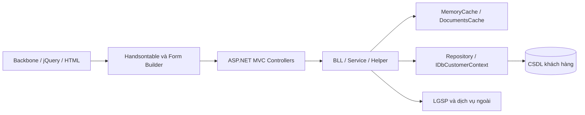
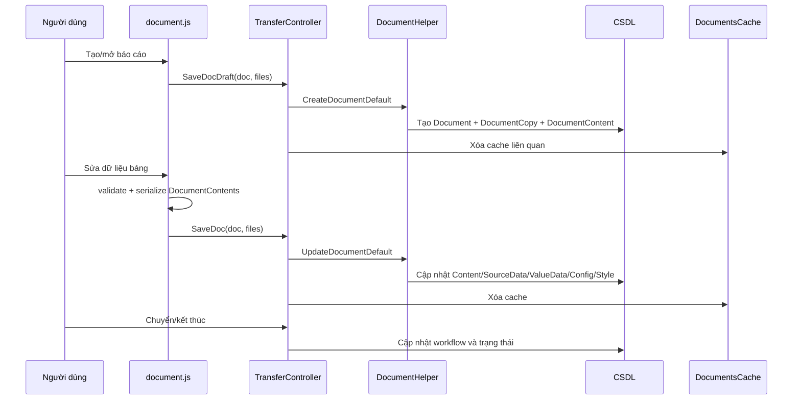
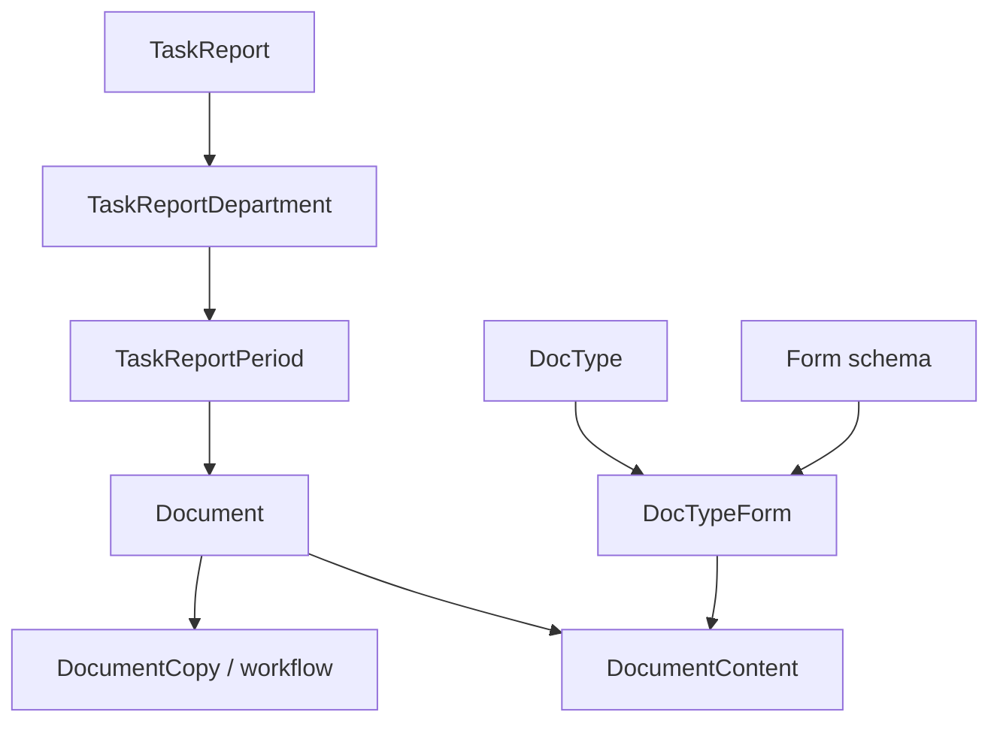

# Phân tích hệ thống eForm hiện tại

## 1. Phạm vi và nguyên tắc khảo sát

- Mã nguồn tham chiếu: `C:\Users\hoang\Downloads\eform_nq`.
- Mã nguồn tham chiếu được giữ nguyên ở chế độ chỉ đọc.
- Chỉ khảo sát tệp `.cs`, `.html`, `.js`; bỏ qua `bin`, `obj`, thư viện bên thứ ba, Handsontable, Bootstrap và toàn bộ ảnh.
- Tổng cộng có 7.036 tệp thuộc ba loại được phép: 2.301 C#, 762 HTML và 3.973 JavaScript. Việc trace tập trung vào các controller, BLL, entity, mapping, cache và mã JavaScript liên quan trực tiếp đến Document, Report và Excel.
- Không đọc `.csproj`/cấu hình ngoài ba loại tệp cho phép, nên phiên bản .NET Framework chính xác của hệ thống gốc chưa được khẳng định từ project metadata.

## 2. Kiến trúc tổng thể

Hệ thống là ứng dụng ASP.NET MVC/Web API kiểu legacy, giao diện dùng Backbone/jQuery và bảng động Handsontable. Tầng nghiệp vụ dùng các lớp BLL/service, truy cập dữ liệu qua repository trên `IDbCustomerContext`/Entity Framework. Hệ thống có cả mapping MySQL và SQL Server; các rule eForm được cung cấp trong tài liệu SQL lần này là MySQL.



Các vùng mã quan trọng:

| Vùng | Vai trò |
|---|---|
| `Solution/Controllers/DocumentController.cs` | Mở chi tiết hồ sơ, lấy dữ liệu biểu, thao tác Document |
| `Solution/Controllers/TransferController.cs` | Lưu nháp, lưu nội dung, chuyển xử lý |
| `Solution/Controllers/DocumentHelper.cs` | Tạo/cập nhật Document, DocumentCopy và DocumentContent |
| `Solution.Business/Customer/DocumentBll.cs` | Nghiệp vụ Document |
| `Solution.Business/Customer/DocumentCopyBll.cs` | Bản xử lý, cache và quyền trên văn bản |
| `Solution.Business/Utils/DocumentPermissionHelper.cs` | Tính quyền xem/sửa/chuyển/kết thúc |
| `Solution/Scripts/solution.egov/views/document/document.js` | View chính của hồ sơ và điều phối nhập Excel |
| `.../report/reportHandler.js` | Serialize/deserialize dữ liệu báo cáo |
| `.../report/reportTabular.js` | Render và thao tác bảng đơn |
| `.../report/renderMultiForms.js` | Render và serialize nhiều form |
| `.../report/reportValidator*.js` | Rule engine, validation đơn/đa biểu và kiểm tra chéo |
| `Solution.Business/Utils/XlsxToJson.cs` | Bộ đọc XLSX cũ bằng ClosedXML |
| `Solution.Business/Customer/DatasourcePlus/EformDatasouceBll.cs` | Đồng bộ bảng/cột, xuất dữ liệu báo cáo và tích hợp LGSP |

Lưu ý: entity `Report` phục vụ một nhánh báo cáo/truy vấn thống kê chung. Luồng báo cáo eForm đang khảo sát chủ yếu được tạo bởi `DocType + Form + TaskReport + Document`, không nên đồng nhất hai khái niệm này.

## 3. Mô hình dữ liệu cốt lõi

### 3.1. Document và luồng xử lý

`Document` là bản ghi nghiệp vụ chính. Các trường liên quan trực tiếp đến module import gồm:

- `DocumentId`, `DocTypeId`, `FormId`;
- `Status`, `StatusReport`, `StatusOpenClose`;
- `UserCreatedId`, `TimeKey`, `Organization`, `OrganizationCode`;
- `CompilationData`, `IsImportExcel`;
- tập `DocumentContents`.

`DocumentCopy` đại diện bản đang đi qua workflow, có `DocumentCopyId`, `DocumentId`, `WorkflowId`, `NodeCurrentId`, người/đơn vị đang giữ, lịch sử, trạng thái, `FormId`, `TimeKey` và `OrganizationCode`.

Trạng thái Document được biểu diễn bằng flags:

- `DuThao = 1`;
- `DangXuLy = 2`;
- `KetThuc = 4`;
- `LoaiBo = 8`;
- `DungXuLy = 16`;
- `LienThongTrungSo = 32`.

### 3.2. DocumentContent

Mỗi biểu gắn vào hồ sơ được lưu trong `documentcontent`:

| Trường | Ý nghĩa |
|---|---|
| `DocumentContentId` | Khóa của nội dung |
| `DocumentId`, `FormId` | Liên kết hồ sơ và schema form |
| `ContentName`, `FormTypeId`, `IsMain` | Nhận diện nội dung |
| `Content` | Dữ liệu legacy/HTML; hiện vẫn được ghi để tương thích |
| `SourceData` | JSON hàng nguồn, giữ công thức nếu có |
| `ValueData` | JSON hàng đã tính/chuẩn hóa |
| `FormConfig` | Header, cột, độ rộng, merge, read-only, column settings |
| `FormStyle` | Class ô, màu, chiều cao, merge runtime, header/footer |
| `Version`, `DocumentContentDetails` | Theo dõi phiên bản nội dung |

`DocumentContentModel` còn mang metadata schema lúc render: `DefineFieldJson`, `DefineConfigJson`, `DefineValueJson`, `FormHeader`, `FormFooter`, `FormCode`, `JsonRule`, `JsonFormOption` và `FormCategoryId`.

### 3.3. DocType, Form và liên kết

- `DocType` định nghĩa loại báo cáo/văn bản, mã biểu, chế độ báo cáo, action level và quyền nghiệp vụ.
- `Form` định nghĩa schema: `DefineFieldJson`, `DefineConfigJson`, `DefineValueJson`, `FormHeader`, `FormFooter`, `TableName`, `FormCode`, `JsonRule`, `JsonFormOption`.
- `DocTypeForm` là bảng nối nhiều-nhiều và đánh dấu `IsPrimary`.

Khi AI nhận diện biểu, `DocTypeId` và `FormId` phải được resolve từ server. Không chấp nhận để AI tự tạo ID hoặc tự quyết định schema mới.

## 4. Document lifecycle



Luồng chi tiết:

1. View lấy thông tin khởi tạo hoặc chi tiết hồ sơ.
2. Hồ sơ mới luôn được tạo nháp trước bằng `SaveDocDraft` rồi `CreateDocumentDefault`.
3. `DocumentCopyBll.GetFromCache(id, currentUserId)` nạp bản chi tiết và kiểm tra quyền xem trước khi trả dữ liệu.
4. Người dùng sửa các control và bảng.
5. `reportHandler.serialize()` hoặc `serializeSaveDocument()` tạo payload.
6. `/Transfer/SaveDoc` gọi `UpdateDocumentTransfer`, sau đó `DocumentHelper.UpdateDocumentDefault` cập nhật các trường của `DocumentContent`.
7. Khi chuyển workflow hoặc kết thúc, các controller khác cập nhật `DocumentCopy`, history, trạng thái và cache.

Điểm cần lưu ý: trong đoạn lưu nội dung đã trace, `UpdateDocumentDefault` lấy `DocumentCopy` theo ID rồi map model vào entity. Chưa thấy lời gọi trực tiếp tới `DocumentPermissionHelper` hoặc kiểm tra `TaskReportPeriod.IsLock` ngay tại đường ghi này. Quyền UI/workflow không nên được xem là đủ; module import mới phải kiểm tra quyền sửa và khóa kỳ ở server trước mọi thao tác tạo job, preview và commit.

## 5. Report lifecycle

Luồng báo cáo định kỳ được ghép từ nhiều đối tượng:



- `TaskReport` định nghĩa báo cáo được giao, đơn vị giao/nhận và lịch lặp.
- `TaskReportDepartment` ghi nhận đơn vị được giao, người xử lý và báo cáo cha/con.
- `TaskReportPeriod` mang `PeriodDetail`, `DocumentId`, `ParentDocumentId`, `IsActive`, `IsLock`.
- Khi báo cáo bị khóa, quy trình mở khóa đọc `TaskReportPeriod` theo `DocumentId`, kiểm tra `IsLock`, lý do chậm và vai trò người yêu cầu/phê duyệt.

`TaskReportPeriodBll.GetByDocumentId` chỉ trả bản active mới nhất. Các hàm gọi hiện tại có nơi dereference kết quả mà chưa kiểm tra null; module mới phải xử lý rõ trường hợp Document không thuộc kỳ báo cáo.

## 6. Handsontable lifecycle

### 6.1. Load và render

1. Backend trả `DocumentContents` cùng schema Form.
2. Bảng ưu tiên đọc cấu hình từ `FormConfig`, dữ liệu từ `SourceData`; các trường legacy như `FormCode`/`ProcessInfo` vẫn có fallback trong một số nhánh.
3. `reportTabular.js` dựng columns, nested headers, merges, chiều rộng, cells callback và hooks.
4. `renderMultiForms.js` lặp qua các `DocumentContent`, dựng bảng hoặc form builder riêng cho từng `FormId`.
5. `FormStyle` khôi phục class, màu, chiều cao, merge runtime và header/footer.

### 6.2. Edit và serialize

- `getSourceData()` giữ giá trị nguồn/công thức.
- `getData()` trả giá trị đã được công thức/plugin tính.
- `reportHandler` map mảng tính toán ngược về object theo `columns[i].data`.
- `SourceData`, `ValueData`, `FormConfig`, `FormStyle` được ghi lại vào từng `DocumentContents[i]`.
- `ProcessInfo` được đặt `null`; dữ liệu mới nằm trong `DocumentContent`.
- Multi-form dùng `FormId`/vị trí mảng để gắn bảng với content. Nhánh import mới vẫn có fallback theo index, đây là điểm dễ gắn nhầm biểu.

### 6.3. Read-only sau import

`document.js` coi báo cáo là read-only nếu `IsImportExcel == true` hoặc đã qua node đầu (`NodeCurrentId > 1`). Sau import, parent view đặt `_importedFromExcel` và `IsImportExcel`, nạp dữ liệu rồi khóa bảng. Cơ chế này chỉ là hành vi phía trình duyệt; server vẫn phải tái kiểm tra quyền và trạng thái.

## 7. DataField và schema cột

Hệ thống có hai nhóm model gần nhau:

1. Nhóm legacy `DataField`/`DataFieldTemplate`:
   - `FieldName`, `Description`, `Datatype`, `DataTableId`, `FieldType`, `IsActivated`;
   - template giữ `TemplateId`, `FieldName`, `Datatype`.
2. Nhóm `Eform_Datafield` thuộc DataSource Plus:
   - `FieldName`, tên hiển thị, mô tả, kiểu và độ dài;
   - required, read-only, hidden, default, scope, overwrite, encryption;
   - thuộc `Eform_Datatable` và `Eform_Datasource`.

Schema render thực tế còn nằm trong JSON của `Form`:

- `DefineFieldJson`: tên/ghi chú phần header định nghĩa;
- `DefineConfigJson.data`: cấu hình từng cột và rule;
- `DefineValueJson`: giá trị mặc định;
- `FormConfig.extra.columnSetting`: required, column key, kiểu editor và thuộc tính hiển thị;
- `FormConfig.header`: ánh xạ field key sang kiểu dữ liệu.

Kết luận: DataField chỉ là một nguồn candidate. Gói schema gửi sang AI phải hợp nhất DocType, Form, DataField/DataFieldTemplate, column settings và rule, nhưng `FormId + field key` trong schema eForm vẫn là khóa đích cuối cùng.

## 8. Load/save value

Luồng chuẩn của một bảng:

```text
Form schema + DocumentContent.SourceData + DocumentContent.FormStyle
  -> dựng Handsontable
  -> người dùng sửa
  -> getSourceData() = raw/source
  -> getData() = computed/display values
  -> serialize theo columns[].data
  -> DocumentContent.SourceData / ValueData / FormConfig / FormStyle
  -> UpdateDocumentDefault
```

`DocumentHelper.UpdateDocumentDefault` chỉ cập nhật `DocumentContent` có `DocumentContentId` khớp với content đã có của Document. Đây là cơ chế tốt để chống việc tự thêm content tùy ý, nhưng cần bổ sung đối chiếu `DocumentId`, `FormId`, quyền sửa và concurrency token trong module mới.

## 9. Validation hiện tại

### 9.1. Rule động

`reportValidateConfigBuilder.js` đọc từng hàng `DefineConfigJson.data`; ô cuối hàng chứa JSON rule. Nó kết hợp:

- `columnSetting.Required`;
- kiểu trong `FormConfig.header` (`int`, `double`, ...);
- rule có `Type = rule` hoặc `Type = form`;
- `Rule`, `Message`, `Info`, `IsAllow`.

`reportValidator.js` kiểm tra required, kiểu số, biểu thức giữa các cột và trả `alerts`, `alertColors`, `isValid`. `IsAllow = true` là cảnh báo; `false` là lỗi chặn.

### 9.2. Rule đặc thù và rule chéo

- Có validator riêng cho single-form và multi-form.
- `reportValidator.js` chứa một số rule đặc thù viết cứng cho nhóm biểu 01d/01e.
- `reportCrossDocValidator.js` chứa cấu hình viết cứng cho các cặp 15b↔15a, 01c↔01b và 02a↔01c.
- Kiểm tra chéo gọi đồng bộ `/Document/GetValueData` theo `docTypeCode`, `userCreatedId`, `timeKey`.

### 9.3. Khác biệt giữa lưu và chuyển

- `serialize()` dừng khi có lỗi chặn.
- `serializeSaveDocument()` chỉ cảnh báo lỗi DOM rồi vẫn có thể tiếp tục lưu.
- Khi dữ liệu vừa import hoặc bảng đã read-only, một số cổng validation DOM bị bỏ qua với giả định iframe đã kiểm tra.

Vì vậy module AI không được tự tuyên bố dữ liệu hợp lệ. Backend mới cần chạy validation độc lập trước preview và trước commit, dùng cùng semantics với rule eForm. Validation phía client chỉ phục vụ phản hồi nhanh.

## 10. Authentication và authorization

### 10.1. Cơ chế đang có

- `DocumentController` và `FormController` gắn `[EgovAuthorize]`.
- `EgovAuthorizeAttribute` kiểm tra cookie SSO, trạng thái user, giới hạn thiết bị và dựng Forms Authentication cookie chứa user context.
- `DocumentCopyBll` dùng `DocumentPermissionHelper` khi mở hồ sơ và trả `DocumentPermissions` cho toolbar.
- `DocumentPermissions.SuaVanBan` là quyền sửa nội dung động/HTML; còn có `XemVanBan`, `DinhKem`, `Luuvanban`, `BanGiao`, `KetThucXuLy`, v.v.
- Quyền phụ thuộc user đang giữ, ủy quyền, node permission, DocType permission và trạng thái Document.

### 10.2. Các điểm cần siết trước khi tích hợp import

| Điểm | Hiện trạng quan sát | Yêu cầu cho module mới |
|---|---|---|
| `FormController.GetDataFromExcel` | Có auth cấp controller, không thấy anti-forgery hay Document context | POST có anti-forgery, kiểm tra quyền sửa trên chính Document |
| `TransferController.SaveDoc` | Có `ValidateAntiForgeryToken` | Giữ nguyên và kiểm tra quyền/lock server-side |
| `SaveDocDraft` | Anti-forgery đang comment | Không tái sử dụng trực tiếp cho upload/import |
| `DocumentController.GetValueData` | Nhận `userCreatedId` từ client; không thấy null/ownership guard trong method | Resolve người dùng/phạm vi từ server, không tin ID từ client |
| iframe import | Message handler chỉ xét `event.data.type` | Bắt buộc kiểm tra `event.origin` và `event.source` |
| kết nối DataSource | Entity chứa connection string/user/password | Client chỉ gửi DataSourceId; secret chỉ resolve server-side |

Đây là các phát hiện từ đường mã đã trace, không phải kết quả pentest toàn hệ thống.

## 11. DataSource và kết nối CSDL

- `IDbCustomerContext` cung cấp repository và raw query/procedure.
- `Eform_Datasource` lưu loại DB, server, port, database, username/password, connection string, department và type.
- `Eform_Datatable`/`Eform_Datafield` mô tả bảng/cột vật lý.
- `EformDatasouceBll` có logic đồng bộ cấu trúc, tạo/cập nhật bảng, lấy metadata, gửi dữ liệu báo cáo và LGSP.
- `Ef_DataSourceBll` hiện gần như chỉ khởi tạo repository/cache, chưa có API nghiệp vụ đáng kể.

Module import không nên truy cập connection string do trình duyệt cung cấp và AI service không nên kết nối trực tiếp CSDL eForm. `.NET ImportDocument` phải resolve DataSource theo tenant/user, dùng tài khoản tối thiểu quyền và chỉ đưa schema cần thiết sang AI.

## 12. Cache

- `MemoryCacheManager` cung cấp get/set/remove/clear trên cache dùng chung.
- `DocumentsCache` cache theo `DocumentCopyId`, map content, attachment, relation và comment.
- Sau `SaveDoc`, controller gọi xóa cache liên quan.

Khi commit import, phải đi qua service lưu hiện hữu hoặc phát đúng cơ chế invalidation. Ghi thẳng DB sẽ tạo dữ liệu cache cũ và bỏ qua lịch sử/nghiệp vụ.

## 13. Excel handling hiện tại

### 13.1. Luồng cũ: upload lên server

```text
document.js/importExcel.js
  -> POST /Form/GetDataFromExcel
  -> XlsxToJson(ClosedXML)
  -> luôn đọc sheet 1
  -> header/data theo chỉ số dòng
  -> trả JSON + merge ranges
  -> map theo key/thứ tự cột
  -> loadData() và validate ở client
```

Giới hạn/rủi ro:

- UI cho chọn `.xls` và `.xlsx`, nhưng parser chính dùng `XLWorkbook`; hỗ trợ `.xls` không rõ ràng.
- Không thấy giới hạn kích thước, magic signature, số sheet/ô hay timeout.
- Dùng `int.Parse` cho chỉ số dòng; lỗi đầu vào dễ thành exception.
- Endpoint không gắn Document context và không kiểm tra quyền sửa Document.
- Mặc dù UI có nhập vùng header/data, `document.js` ghi đè `HeaderAI` bằng giá trị suy ra từ schema trong một nhánh.
- Chỉ đọc sheet đầu.
- Mapping phụ thuộc vị trí/key, chưa hiểu semantic header nhiều tầng.
- Biến snapshot rollback (`oldDataSnapshot`, `oldMergeCells`, `oldColumns`) được tham chiếu nhưng không thấy nơi khởi tạo trong `document.js`.
- Response dùng tên `succress`, cho thấy contract không được kiểm thử chặt.

`XlsxToJson.cs` bản thân có nhiều khả năng hơn endpoint đang dùng: đếm sheet, đọc header/comment, merge, style, width, formula và chuyển HTML. Phần reusable là kinh nghiệm đọc ClosedXML, không nên tái sử dụng nguyên controller contract cũ.

### 13.2. Luồng mới: iframe phía client

```text
document.js
  -> mở document-import-excel-handsel.html
  -> xlsx-js-style đọc workbook ở browser
  -> người dùng chọn sheet/form
  -> mapping và validation JavaScript
  -> postMessage IMPORT_EXCEL_DONE
  -> parent thay SourceData/ValueData, đặt IsImportExcel
  -> lưu bằng SaveDoc thông thường
```

Ưu điểm:

- Có thể đọc nhiều sheet.
- Có preview và validation trước khi đưa vào bảng.
- Gắn được nhiều form trong một Document.

Thiếu sót:

- Không có DocType classification hay semantic DataField mapping thật sự.
- Sheet nhiều phải chọn thủ công; ghép form chủ yếu theo thứ tự.
- Có fallback gắn `DocumentContent` theo index.
- Chứa nhiều cấu hình/rule đặc thù biểu viết cứng.
- Chưa có ImportJob, audit, confidence, model version, feedback hay commit transaction riêng.
- Tải thư viện qua CDN trong template; không phù hợp môi trường IIS nội bộ nếu bị chặn mạng và làm tăng rủi ro supply chain.
- Parent chưa kiểm tra origin/source của `postMessage`.

## 14. Rule SQL

`update_all_rules_eform_1.sql`:

- tạo backup `form_backup_rules_import` và bảng log tạm;
- có bốn stored procedure để khôi phục vị trí rule, dọn biểu tổng hợp, cập nhật rule và hậu kiểm rule chéo phần;
- rule nằm tại `DefineConfigJson.data[column][H + 14]`, với `H` là số field trong `DefineFieldJson.data`;
- ô `H + 15` được xóa; thuộc tính read-only tại `H + 4` được khôi phục `"false"`;
- biểu tổng hợp/chữ hoa bị loại khỏi gán rule;
- có 644 lệnh gán, 54 mã biểu, 770 lần xuất hiện rule, 148 biểu thức duy nhất;
- 727 rule chặn và 43 rule cảnh báo;
- biểu thức gồm tổng, so sánh, AND/OR, tỷ lệ và `Math.round`.

Các điểm cần kiểm thử trước khi chạy ở bất kỳ DB nào:

- backup dùng `CREATE TABLE IF NOT EXISTS ... AS SELECT`, nên chạy lại không tạo snapshot mới;
- script cập nhật trực tiếp hàng loạt JSON và phải chạy trên bản sao/staging trước;
- có biểu thức đáng ngờ như khoảng trắng giữa `#` và số, cùng các phép chia cần xử lý mẫu số 0;
- rule được lặp vào nhiều cột để tô lỗi; engine cần deduplicate thông báo nhưng vẫn đánh dấu đủ ô;
- nhận diện Mục I/II dựa trên chuỗi mã/tên, cần test với naming thực tế.

## 15. Điểm tích hợp đề xuất

Điểm phù hợp nhất là một module backend mới đứng trước bước cập nhật `DocumentContents`:

```text
Upload có Document context
  -> kiểm tra auth/quyền/lock/tenant
  -> tạo ImportJob
  -> phân tích workbook trong sandbox
  -> lấy schema eForm từ server
  -> mapping deterministic + semantic
  -> validation eForm
  -> preview có confidence và provenance
  -> người dùng xác nhận/sửa mapping
  -> tái kiểm tra quyền/lock/concurrency
  -> gọi service lưu hiện hữu
  -> audit + cache invalidation
```

Không tích hợp AI trực tiếp vào `FormController.GetDataFromExcel` vì endpoint đó thiếu Document context và contract quá hẹp. Không để Python gọi DB eForm hoặc `SaveDoc` trực tiếp.

## 16. Phần có thể tái sử dụng và phần phải xây mới

### Tái sử dụng

- Entity/BLL của DocType, Form, DocTypeForm, Document, DocumentContent.
- `DocumentPermissionHelper` và bitmask `DocumentPermissions`.
- Cách serialize `SourceData`, `ValueData`, `FormConfig`, `FormStyle`.
- Rule schema trong `DefineConfigJson` và semantics `IsAllow`.
- Service lưu hiện hữu và cơ chế xóa `DocumentsCache`.
- Một phần kỹ thuật ClosedXML của `XlsxToJson` sau khi tách thành service an toàn.

### Xây mới

- Upload/quarantine và kiểm tra file an toàn.
- ImportJob có trạng thái, progress, expiry và idempotency.
- Workbook/sheet/region/table/header analyzer tổng quát.
- Schema snapshot và candidate index.
- Mapping exact/normalized/fuzzy/embedding/LLM fallback.
- Confidence, explainability và provenance tới ô Excel.
- Validation server-side tương thích rule eForm.
- Preview/confirm/commit có optimistic concurrency.
- Audit, feedback review, dataset version và model version.

## 17. Rủi ro ưu tiên

| Mức | Rủi ro | Hành động |
|---|---|---|
| Cao | Ghi dữ liệu khi không có quyền sửa hoặc kỳ đã khóa | Check `SuaVanBan`, holder/node, `IsLock`, trạng thái ở mọi API và commit |
| Cao | AI/iframe ghi nhầm Form theo index | Chỉ commit bằng `DocumentContentId + FormId`, cấm fallback index |
| Cao | Upload độc hại/zip bomb/file quá lớn | Signature, extension, giới hạn byte/sheet/cell/ratio, timeout, quarantine |
| Cao | Rò connection string hoặc dữ liệu nhạy cảm | Resolve DataSource server-side, redaction, không gửi secret sang AI |
| Cao | Validation client bị bypass | Validation server-side hai lần: preview và commit |
| Trung bình | Rule động và rule JS đặc thù lệch nhau | Chuẩn hóa rule catalog, regression test theo DocType |
| Trung bình | Cache stale do ghi thẳng DB | Commit qua service và invalidation hiện hữu |
| Trung bình | Race giữa preview và commit | Schema version + row version/hash + idempotency key |
| Trung bình | LLM sinh JSON sai/hallucination | JSON schema, allow-list field, deterministic verifier, không auto-commit |

## 18. Kết luận discovery

Hệ thống đã có schema động, dữ liệu bảng tách raw/computed, workflow, permission và validation đáng kể. Khoảng trống không nằm ở việc “đọc được XLSX”, mà ở hiểu workbook bất định, chọn đúng DocType/Form/DataField, giải thích độ tin cậy và đưa kết quả qua một cổng server-side an toàn. Thiết kế mới phải bọc quanh nghiệp vụ hiện hữu, không thay thế schema eForm và không cho AI quyết định commit.
