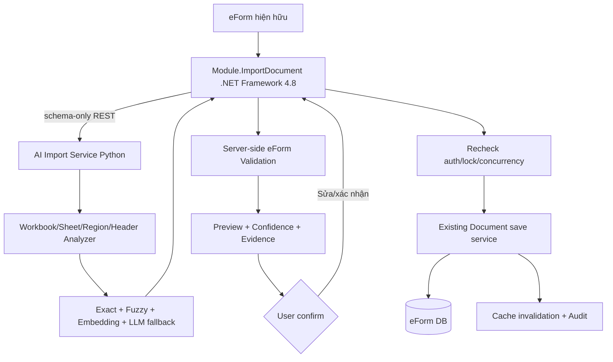

# Báo cáo phân tích lần đầu — Intelligent Excel Import

Tài liệu này là báo cáo A–R bắt buộc sau STEP 1–10 của `MASTER PROMPT.md`. Hai báo cáo chi tiết đi kèm:

- [CURRENT_SYSTEM_ANALYSIS.md](CURRENT_SYSTEM_ANALYSIS.md)
- [EXCEL_ANALYSIS.md](EXCEL_ANALYSIS.md)

Theo phase gate của prompt, chưa viết code AI hoặc giao diện ở lần bàn giao này.

## A. Internship Plan

Kế hoạch trong tài liệu thực tập được quy đổi thành deliverable kỹ thuật như sau:

| Tuần | Nội dung trong kế hoạch | Deliverable đề xuất | Tiêu chí hoàn thành |
|---:|---|---|---|
| 2 | Đề xuất nhập Excel thông minh; so sánh AI/LLM; thiết kế kiến trúc/data flow | Báo cáo discovery, Excel analysis, gap, target architecture, model shortlist | Mentor duyệt boundary, contract và tiêu chí benchmark |
| 3 | Backend .NET MVC API đọc Excel thô và flatten JSON; Git/PR | Safe upload, ImportJob, workbook analyzer, JSON contract, unit test | Đọc được unknown workbook trong quota; không hard-code file mẫu |
| 4 | Tạo sample data và prompt để hiểu chỉ tiêu phân cấp | Dataset v1, labeling guide, baseline exact/normalized/fuzzy/embedding | Mapping cơ bản có benchmark theo field/sheet/form |
| 5 | Tối ưu AI, chuẩn hóa JSON, sửa nhầm hierarchy; cân nhắc cost/latency | Hybrid mapper, confidence calibration, LLM fallback, validation engine | JSON luôn hợp schema; giảm nhầm Tổng/Mục I/II/1/2; có latency/cost report |
| 6 | Tích hợp backend từ AI JSON vào DB | Preview/confirm/commit, permission/lock/concurrency, audit, cache invalidation | Lưu đúng `DocumentContent`, rollback được, có test report |

## B. Current Architecture

Hệ thống hiện tại là ASP.NET MVC/Web API legacy với Backbone/jQuery/Handsontable ở client, BLL/service ở giữa và repository/Entity Framework qua `IDbCustomerContext`. Dữ liệu eForm được quyết định bởi `DocType`, `Form`, `DocTypeForm`, `Document`, `DocumentCopy` và `DocumentContent`; cache chi tiết nằm trong `DocumentsCache`.

Điểm quan trọng nhất là hệ thống đã tách:

- schema/config (`Define*Json`, `FormConfig`);
- dữ liệu nguồn (`SourceData`);
- dữ liệu tính toán (`ValueData`);
- style runtime (`FormStyle`);
- workflow/quyền (`DocumentCopy`, node permission, `DocumentPermissions`);
- kỳ giao báo cáo (`TaskReport*`).

## C. Document Flow

```text
Get info/create
  -> SaveDocDraft
  -> CreateDocumentDefault
  -> Document + DocumentCopy + DocumentContent
  -> GetDocumentDetail qua cache/quyền xem
  -> edit + serialize
  -> SaveDoc
  -> UpdateDocumentDefault
  -> transfer/finish/lock
  -> cache invalidation
```

Các trạng thái chính là dự thảo, đang xử lý, kết thúc, loại bỏ và dừng xử lý. Bản workflow hiện hành nằm ở `DocumentCopy`; dữ liệu bảng nằm ở các `DocumentContent` thuộc Document.

## D. Report Flow

`DocType` chọn một hoặc nhiều `Form` qua `DocTypeForm`. `TaskReport` giao báo cáo cho đơn vị; `TaskReportDepartment` và `TaskReportPeriod` lưu đơn vị/kỳ/Document/lock. Khi người dùng tạo báo cáo, hệ thống sinh Document/DocumentCopy/DocumentContent và đưa qua workflow. Báo cáo tổng hợp còn có lớp DataSource Plus và các function/bảng fact riêng.

## E. Handsontable Flow

```text
FormConfig + SourceData + FormStyle
  -> build columns/nested headers/merges/cells
  -> render single hoặc multi-form
  -> edit hooks
  -> validate
  -> getSourceData() / getData()
  -> map theo columns[].data
  -> SourceData / ValueData / FormConfig / FormStyle
  -> SaveDoc
```

Nhánh save thường có thể cảnh báo nhưng vẫn lưu; nhánh transfer dùng validation chặn chặt hơn. Báo cáo import được đặt read-only phía client. Đây là lý do validation và permission phải được lặp lại ở backend.

## F. DataField Model

Candidate schema có ba nguồn:

1. `DataField`/`DataFieldTemplate` legacy;
2. `Eform_Datafield`/`Eform_Datatable` trong DataSource Plus;
3. JSON schema thực tế trong `Form` và `DocumentContent.FormConfig`.

Index semantic nên tạo một record cho mỗi field với:

```text
Tenant/DocTypeId/FormId/fieldKey
display name + normalized name + aliases
full header path + unit + data type
required/read-only/hidden/default
rules + neighboring fields + section/part
schema version
```

## G. Validation

Hệ thống có rule engine động đọc rule JSON từ `DefineConfigJson`, required/type từ `columnSetting`/`header`, validator single/multi-form và validator chéo báo cáo. Ngoài ra vẫn có rule biểu đặc thù viết cứng trong JavaScript.

SQL lần này có 644 lệnh gán rule cho 54 mã, 770 rule occurrence, 148 biểu thức khác nhau; 727 rule chặn và 43 cảnh báo. Rule eForm phải được chuẩn hóa thành AST/an toàn để backend chạy lại; không dùng JavaScript `eval` hay để LLM đánh giá đúng/sai.

## H. Authorization

Người được nhập/sửa phải đồng thời thỏa:

- đã xác thực đúng tenant;
- xem được Document;
- có `SuaVanBan`/quyền node phù hợp hoặc quyền tạo khi là draft mới;
- là người đang giữ hoặc được ủy quyền theo workflow;
- kỳ `TaskReportPeriod` chưa khóa;
- Document chưa ở trạng thái cấm sửa;
- `DocumentCopyId`, `DocumentId`, `DocTypeId`, `FormId` thuộc cùng context.

Các kiểm tra này phải áp dụng cho upload, analyze, preview, confirm và commit; commit phải kiểm tra lại vì quyền/lock có thể đổi sau preview.

## I. DataSource

DataSource hiện chứa cả connection metadata và secret. Client chỉ được chọn `DataSourceId`; `.NET ImportDocument` resolve kết nối server-side theo tenant/department và dùng tài khoản tối thiểu quyền. AI service không được nhận connection string và không được truy cập DB eForm trực tiếp.

## J. Current Excel Handling

Có hai luồng:

1. Luồng cũ upload tới `/Form/GetDataFromExcel`, dùng ClosedXML, thực tế đọc sheet đầu và vùng dòng theo chỉ số, rồi map theo key/thứ tự.
2. Luồng iframe mới dùng thư viện XLSX phía browser, cho chọn sheet/form và preview, sau đó `postMessage` dữ liệu về parent rồi lưu bằng `SaveDoc`.

Cả hai chưa có semantic DocType/DataField matching, ImportJob, confidence, model version, feedback review và audit đầy đủ. Luồng mới còn fallback gắn form theo index; luồng cũ thiếu Document context.

## K. Excel Analysis

- Workbook Phường Láng: một sheet, bảng `A3:I8`, header 5 tầng tính cả hàng số cột, một data row, không formula, có title/footer và một ô nhiễu ngoài bảng.
- `ví dụ 2.xlsx`: cùng bảng/dữ liệu nhưng khác tên sheet, thiếu title/footer và khác style.
- Workbook KHTC: 77 sheet, 67 visible, 10 hidden, 62 template biểu nhập, 449 formula và 3.006 merge; có sheet metadata/workflow/tổng hợp, styled blank rows và dữ liệu nhạy cảm.
- Tám template chưa có mã tương ứng trong SQL rule: `6c, 6d, 7, 9c, 11a, 17, 19b, 20a`.

Chi tiết từng sheet nằm trong `EXCEL_ANALYSIS.md`.

## L. Expected Result

Kết quả đúng không phải là “copy nguyên sheet vào bảng”. Kết quả cần:

- chọn đúng DocumentContent/Form;
- giữ đúng thứ tự field key của eForm;
- phân biệt metadata, header, data, note, footer và bảng phụ;
- dựng đúng row hierarchy;
- giữ raw formula/value/provenance;
- chuẩn hóa value theo type;
- chạy rule eForm;
- trả preview Handsontable-compatible cùng lỗi/cảnh báo/confidence;
- chỉ commit sau xác nhận.

Ảnh kết quả mong đợi không được đọc do yêu cầu rõ của người dùng, nên chưa có kết luận so sánh trực quan ảnh ↔ Handsontable. Đây là giới hạn có chủ ý, không phải dữ liệu bị bỏ sót ngoài ý muốn.

## M. Gap Analysis

| Capability | Hiện có | Còn thiếu |
|---|---|---|
| Đọc XLSX | ClosedXML và XLSX browser | Safe quota, quarantine, unknown workbook analyzer |
| Nhiều sheet | Iframe có chọn sheet | Sheet classifier/ranker tự động |
| Region/header | Chủ yếu chỉ số và template | Multi-region detection, header tree, hierarchy |
| DocType/Form | User/context biết trước | Candidate identification có confidence |
| Field mapping | Theo key/vị trí | Exact + normalized + fuzzy + embedding + LLM fallback |
| Validation | Rule client phong phú | Backend engine tương thích và chống bypass |
| Permission | Có helper/workflow | Gắn bắt buộc vào mọi import API và recheck commit |
| Persistence | SaveDoc hiện hữu | ImportJob, preview snapshot, idempotency, concurrency |
| Explainability | Thông báo rule | Evidence/reason/provenance cho từng mapping |
| Learning | Chưa có | Feedback review, dataset/model version, benchmark |
| Security | Auth hiện hữu | File safety, secret/PII redaction, origin check, audit |

## N. Proposed AI Approach

Đề xuất pipeline phân tầng:

1. **Deterministic analyzer**: kiểm tra file, đọc workbook, non-empty bounds, region, merge/header tree, value type, row hierarchy.
2. **Exact/normalized matching**: mã biểu, tên leaf/full path, alias, unit, ordinal, type.
3. **Fuzzy retrieval**: token/character similarity để lấy top-k candidate, không auto-commit nếu chỉ fuzzy thấp.
4. **Embedding reranking**: so semantic header path ↔ field schema trong đúng DocType/Form candidate.
5. **Constraint reranking**: data type, required/read-only, neighboring field, rule graph, part I/II, tổng/chi tiết.
6. **LLM fallback**: chỉ cho case mơ hồ, nhận candidate allow-list và trả JSON theo schema; không được tạo field/ID ngoài danh sách.
7. **Confidence calibration**: kết hợp margin top1-top2, evidence coverage, structural consistency, validation outcome và model calibration.
8. **Human confirmation**: confidence thấp hoặc mapping xung đột luôn cần sửa/xác nhận.
9. **Deterministic validation + commit**: AI kết thúc vai trò trước khi quyết định hợp lệ và ghi dữ liệu.

Gợi ý policy ban đầu, phải hiệu chỉnh bằng validation set:

```text
>= 0.92 và không xung đột: preselect
0.75–0.92: cần người dùng xác nhận
< 0.75 hoặc top1-top2 quá gần: không tự map
```

## O. Model Candidates

Các thông tin dưới đây đã được đối chiếu với model card chính thức tại thời điểm phân tích.

| Candidate | License | Đặc điểm | Vai trò phù hợp | Đánh đổi |
|---|---|---|---|---|
| Không model: exact/normalized/fuzzy | N/A | Nhanh, giải thích rõ | Baseline và high-precision path | Không hiểu paraphrase sâu |
| [multilingual-e5-base](https://huggingface.co/intfloat/multilingual-e5-base) | MIT | 768 chiều, 12 layer, tối đa 512 token, có tiếng Việt | Embedding baseline được khuyến nghị cho MVP | Cần prefix đúng; context ngắn hơn BGE-M3 |
| [BAAI/bge-m3](https://huggingface.co/BAAI/bge-m3) | MIT | 1024 chiều, 100+ ngôn ngữ, tới 8.192 token, dense/sparse/multi-vector | Candidate mạnh để benchmark hybrid/retrieval dài | Nặng hơn, latency/RAM cao hơn |
| [paraphrase-multilingual-mpnet-base-v2](https://huggingface.co/sentence-transformers/paraphrase-multilingual-mpnet-base-v2) | Apache-2.0 | 768 chiều, tiếng Việt, max sequence 128 | Baseline sentence similarity đơn giản | Header path dài dễ bị cắt |
| [Qwen3-8B](https://huggingface.co/Qwen/Qwen3-8B) | Apache-2.0 | 8,2B tham số, 100+ ngôn ngữ, context native 32K | LLM fallback local cho case mơ hồ | Cần GPU/quantization, JSON/latency phải kiểm soát |

Khuyến nghị:

- MVP: deterministic + fuzzy + `multilingual-e5-base`.
- Benchmark challenger: `bge-m3`; chỉ thay nếu tăng macro-F1/top-1 đủ bù latency/RAM.
- `Qwen3-8B` không nằm trên critical path mặc định. Chỉ gọi với top-k candidates và schema-constrained output khi confidence thấp.
- Không fine-tune ngay. Chỉ fine-tune sau khi baseline và error taxonomy chứng minh có lợi.

## P. Dataset Strategy

### Đơn vị nhãn

Mỗi sample mapping chứa:

```text
workbook_id, sheet_id, region, header_path, source_column
doc_type_id, form_id, field_key
source values/type/unit/formula features
label (match/no-match), confidence target
mapping method, reviewer, review status
schema version, dataset version
```

### Nguồn dữ liệu

- schema snapshots từ eForm;
- workbook đã được người có thẩm quyền xác nhận mapping;
- correction khi người dùng sửa preview;
- lịch sử import thành công sau khi redaction;
- synthetic perturbation: bỏ dấu, viết tắt, xuống dòng, merge khác, thêm title/note, đổi sheet name, chèn cột nhiễu;
- hard negatives trong cùng domain/section và cặp Tổng ↔ chi tiết.

### Chống leakage và bảo vệ dữ liệu

- split theo workbook/template/time/đơn vị, không split ngẫu nhiên theo row;
- giữ một tập unknown-template để đo generalization;
- loại password, token, connection string, account sheet, PII và ô ghi chú nhạy cảm;
- feedback chỉ vào training set sau review, không học trực tiếp từ mọi click;
- version hóa schema/dataset/model và lưu lineage.

Metrics chính: DocType top-1/top-k, field macro-F1, exact-match theo table, invalid JSON rate, coverage theo confidence bucket, expected calibration error, validation pass rate, p50/p95 latency và tỷ lệ cần human correction.

## Q. Target Architecture



Boundary:

- `.NET ImportDocument`: auth, authorization, Document context, DataSource resolution, ImportJob, upload policy, schema snapshot, validation, preview, commit, audit.
- Python AI: phân tích workbook và đề xuất mapping; không DB credential, không session cookie, không commit.
- Browser: upload/status/preview/confirm; không tự quyết định quyền hoặc validation cuối.

Chọn .NET Framework 4.8 cho module tích hợp legacy vì phù hợp IIS/ASP.NET MVC cũ hơn, có TLS/runtime tốt hơn 4.5 và giảm rủi ro lifecycle. Tuy nhiên target framework chính xác của source gốc cần được xác minh sau nếu được phép đọc project metadata; module AI Python vẫn tách process nên không buộc thư viện ML vào IIS worker.

API tối thiểu dự kiến:

```text
POST   /api/import-jobs
GET    /api/import-jobs/{id}
POST   /api/import-jobs/{id}/analyze
GET    /api/import-jobs/{id}/preview
PATCH  /api/import-jobs/{id}/mappings
POST   /api/import-jobs/{id}/validate
POST   /api/import-jobs/{id}/commit
DELETE /api/import-jobs/{id}
```

Commit phải idempotent, transactional và từ chối nếu schema/document version khác snapshot preview.

## R. Implementation Plan

### Tuần 2 — chốt kiến trúc

- Mentor review ba tài liệu discovery/Excel/A–R.
- Xác minh target framework, DB engine và deployment constraints khi được phép đọc metadata.
- Chốt JSON contract, security quotas, metrics và acceptance dataset.
- Chốt điểm gọi service lưu hiện hữu; không sửa source gốc.

### Tuần 3 — analyzer và .NET boundary

- Dựng solution/module, ImportJob và safe upload.
- Viết analyzer workbook/sheet/region/header không hard-code mẫu.
- Sinh JSON normalized có provenance.
- Test ba workbook và cases zip bomb/malformed/oversized.

### Tuần 4 — dataset và baseline

- Snapshot eForm schema, tạo labeling guide và dataset v1.
- Implement exact/normalized/fuzzy.
- Implement embedding adapter và benchmark E5/BGE-M3.
- Lập error taxonomy cho DocType, part, header hierarchy, field và value.

### Tuần 5 — hybrid, confidence và validation

- Constraint reranker, confidence calibration và human-review thresholds.
- Rule parser/validation server-side; regression theo 54 mã SQL và tám mã cần xác minh.
- LLM fallback có JSON Schema/allow-list; đo cost/latency và tắt được bằng feature flag.

### Tuần 6 — tích hợp và nghiệm thu

- Preview/confirm/commit với auth, lock, concurrency và idempotency.
- Gọi service lưu hiện hữu, transaction, audit và cache invalidation.
- Integration/security/load tests; model/dataset version report.
- Tài liệu IIS deployment, rollback và demo bằng unknown workbook.

### Gate trước khi code

Chỉ bắt đầu phase triển khai sau khi xác nhận:

1. `DocumentContent.SourceData/ValueData` là đích lưu chuẩn;
2. semantics đầy đủ của `DefineConfigJson` và rule đặc thù;
3. quyền sửa/lock cần gọi ở server;
4. .NET target/deployment thực tế;
5. DB migration policy;
6. dữ liệu nào được phép gửi sang AI service;
7. mentor duyệt kiến trúc và tiêu chí benchmark.
